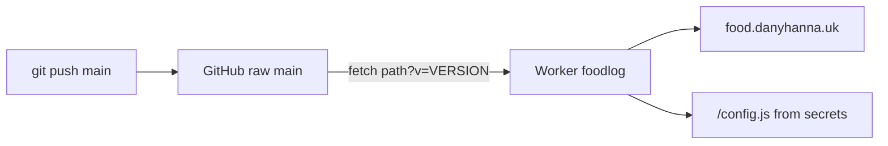

# Plate Log — Regression Guide

Read this **before changing** `app.js` auth logic, `sw.js`, or OAuth-related boot code. It records bugs that were fixed, why they broke, and what not to reintroduce.

**Maintainers:** update this file whenever you fix a production bug or change auth/SW/deploy behavior. Cursor is configured (`.cursor/rules/regression-guide.mdc`) to read and update this guide in those sessions.

**Architecture overview:** [`HOW_IT_WORKS.md`](HOW_IT_WORKS.md)

**Current production deploy:** see [Production deploy (GitHub vs Cloudflare Worker)](#production-deploy-github-vs-cloudflare-worker) — `git push` alone does **not** update what users get until Worker `VERSION` and stamped assets align.

---

## Pre-ship checklist (auth / PWA)

- [ ] `readAuthCallbackFromUrl()` returns an error **only** when `error` or `error_description` is in the URL — **not** when only `?code=` is present (success redirect).
- [ ] OAuth `code` stays in the URL until `getSession()` runs; strip params **after** session exchange.
- [ ] Do **not** `await` Supabase auth calls inside `onAuthStateChange` (use `setTimeout(..., 0)`); boot calls `getSession()` once.
- [ ] Service worker **does not** intercept OAuth return navigations (query **or** hash: `code`, `error`, `access_token`).
- [ ] `sw.js` matches `url.pathname.endsWith("/config.js")` — never put `?v=` in a pathname check (build must not stamp `config.js` inside `sw.js`).
- [ ] `getAuthRedirectUrl()` returns `window.location.origin` (not a hardcoded URL that can mismatch the live site).
- [ ] Supabase Dashboard: **Allow new users to sign up** enabled (otherwise `#error=signup_disabled`).
- [ ] After push that changes HTML/CSS/JS: run `npm run build:deploy`, commit stamped `index.html` / `sw.js`, push, then bump Worker `VERSION` to that commit’s short hash and redeploy (or use CI when added). See [deploy section](#production-deploy-github-vs-cloudflare-worker).

---

## Stable git tags (rollback)

| Tag | Use when |
|-----|----------|
| `stable-1.0` | Last known-good before major UI polish |
| `stable-2.0` | Auth/PWA/mobile fixes after 1.0 regressions |
| `stable-3.0` | Editor admin, pending approvals (early OAuth work; auth still evolved after this tag) |
| `stable-3.1` | OAuth PKCE + pending sync + collapsible Sync + regression guide |
| `stable-3.2` | Map view, location/cuisine lookups, richer client search |

**Known-good auth + pending flow (May 2026):** `main` at or after `7781ab7` / `0e5cd13` (OAuth `?code=` fix). For Worker `VERSION`, use the short hash of the commit that contains the **feature** (HTML/JS/CSS), not only an old tag.

```powershell
git log --oneline -15
git show stable-3.0
git switch -c restore-<name> <tag-or-commit>
```

---

## Auth & OAuth

### 1. Success `?code=` shown as “Sign-in failed” (critical)

| | |
|--|--|
| **Commits** | `7781ab7`, deploy `0e5cd13` |
| **Symptom** | Approved and new users see **Sign-in failed** right after Google; session never starts |
| **Cause** | `readAuthCallbackFromUrl()` treated *any* auth URL (including `?code=...`) as failure and boot exited before `getSession()` |
| **Fix** | Return an error only when `error` or `error_description` is present |
| **Do not regress** | `if (code \|\| error) return { error: "failed" }` — **code means success** |

### 2. OAuth code removed before PKCE exchange

| | |
|--|--|
| **Commits** | `28386f1` |
| **Symptom** | Google redirect returns but user stays logged out |
| **Cause** | `stripAuthParamsFromUrl()` ran in `boot()` **before** `exchangeCodeForSession` / `getSession()` |
| **Fix** | Exchange session first, then strip `code` / hash from URL |
| **Do not regress** | Cleaning `?code=` from the URL at the start of `boot()` |

### 3. `onAuthStateChange` + `getSession` deadlock / slow sign-in

| | |
|--|--|
| **Commits** | `58b7670`, `862d8f2` |
| **Symptom** | Stuck on “Finishing Google sign-in…” for a long time or forever |
| **Cause** | `await` inside `onAuthStateChange` while boot also `await`s `getSession()` |
| **Fix** | Defer auth listener work with `setTimeout`; single boot path; don’t await full `loadRemoteData()` before showing signed-in state |
| **Do not regress** | `async (event, session) => { await refreshAccess(); await getSession(); }` on the listener |

### 4. Double PKCE code exchange

| | |
|--|--|
| **Commits** | `7781ab7` (removed fallback) |
| **Symptom** | Intermittent “invalid grant” / code already used |
| **Cause** | `getSession()` (with `detectSessionInUrl`) exchanged the code, then `exchangeCodeForSession(code)` ran again |
| **Fix** | On `?code=`, use **only** `getSession()` once; no second manual exchange |
| **Do not regress** | Calling both `getSession()` and `exchangeCodeForSession()` for the same redirect |

### 5. OAuth errors only in URL hash (`#error=...`)

| | |
|--|--|
| **Commits** | `f5e2611` |
| **Symptom** | `signup_disabled` stuck in address bar; generic failure message |
| **Cause** | Parser only read `window.location.search`, not `location.hash` |
| **Fix** | `authParamsFromUrl()` reads query **and** hash; strip hash errors after handling |
| **Do not regress** | Only checking `searchParams` for OAuth callback |

### 6. Supabase sign-ups disabled

| | |
|--|--|
| **Symptom** | `#error=access_denied&error_code=signup_disabled` |
| **Cause** | Dashboard: “Allow new users to sign up” off — first Google login is a sign-up |
| **Fix** | Enable sign-ups in Supabase; edit access still gated by `approved_users` |
| **Do not regress** | Assuming OAuth login does not create `auth.users` rows |

### 7. Hardcoded production redirect URL

| | |
|--|--|
| **Commits** | `82bf764` area |
| **Symptom** | OAuth works on one host only or fails locally |
| **Cause** | `redirectTo` pointed at fixed `https://food.danyhanna.uk` while app ran elsewhere |
| **Fix** | `getAuthRedirectUrl()` → `window.location.origin` |
| **Do not regress** | Hardcoding redirect URL unless Worker and Supabase URLs are updated together |

---

## Production deploy (GitHub vs Cloudflare Worker)

Production uses **two separate systems**. Pushing to GitHub updates the source of truth; the **Cloudflare Worker** is what actually serves `food.danyhanna.uk`. They are not wired together unless you add CI (see [Automation](#automation-on-git-push-not-set-up-yet)).



### What each layer does

| Layer | What updates on `git push` | What it controls |
|-------|----------------------------|------------------|
| **GitHub `main`** | Yes — `app.js`, `index.html`, `styles.css`, `sw.js`, etc. | Latest app code on the branch |
| **`npm run build:deploy`** | Only if you run it and **commit** the result | `?v=<hash>` on `styles.css` / `app.js` / `config.js` in `index.html`; `BUILD_ID` in `sw.js` (browser + PWA cache names) |
| **Worker `VERSION`** | **No** — lives in Cloudflare until you change it | Query string on the Worker’s GitHub fetch: `raw.../main/app.js?v=VERSION`; also the **edge cache key** in the live dashboard Worker (`cache.match` uses that URL) |

### Why `VERSION` exists

The Worker does not read files from your laptop. It proxies from:

`https://raw.githubusercontent.com/DanielAshrafHanna/FoodLog/main{path}?v={VERSION}`

`VERSION` is a **cache-buster**, not a git pin. GitHub always serves the tip of `main`; the `?v=` query forces the Worker (and its edge cache) to treat a new deploy as a new asset.

If you push new `app.js` to GitHub but leave `VERSION` at an old value (e.g. `9a8d378`):

1. The Worker’s **edge cache** may still return the old response (cache key includes `?v=VERSION`).
2. Browsers that already have old HTML may still request old `app.js?v=...` links inside that HTML.

So: **`git push` ≠ live site updated** until `VERSION` matches the deploy you intend and stamped HTML is on `main`.

### `VERSION` vs stamps in `index.html` / `sw.js`

Both use the same idea (short git hash) but apply at different hops:

| Mechanism | Where | Purpose |
|-----------|--------|---------|
| `VERSION` in Worker | Cloudflare | Invalidate Worker edge cache + upstream fetch for proxied assets |
| `app.js?v=…`, `styles.css?v=…` in `index.html` | GitHub (via `build:deploy`) | Browser requests the right asset after it receives HTML |
| `BUILD_ID` in `sw.js` | GitHub (via `build:deploy`) | PWA cache name `plate-log-cache-{BUILD_ID}`; new deploy = new SW cache bucket |

You need **both** for reliable releases: stamps help the browser; `VERSION` helps the Worker stop serving a cached copy of an older `main` fetch.

`build.mjs` sets the stamp hash from `git rev-parse --short HEAD` automatically when you run `npm run build:deploy`. That does **not** update Cloudflare — nothing in the repo deploys the Worker today.

### When you must touch Cloudflare

| Situation | Action |
|-----------|--------|
| First deploy / `VERSION` still an old hash | Set `const VERSION = "<short-hash>";` (or `env` equivalent) and **Deploy** |
| Routine release after HTML/JS/CSS change | Bump `VERSION` to the feature commit hash and **Deploy** |
| `VERSION` already correct (e.g. `c0cb9a7`) and only Supabase/DB changed | **No** Worker change |
| Live Worker already matches repo intent | **Do not** replace Worker code just because `cloudflare-worker.mjs` changed — see below |

### Live Worker vs repo template

The Worker in the **Cloudflare dashboard** may differ from [`cloudflare-worker.mjs`](cloudflare-worker.mjs) (e.g. edge `caches.default`, `configResponse()`, `/config.example.js`, stricter `no-cache` on HTML). That is fine.

- **Do not** paste the simpler repo file over a working dashboard Worker unless you intend to change behavior.
- **Do** keep `VERSION` in sync with the release you want users to get.
- Optional: periodically copy dashboard → repo so the template stays accurate.

### Release checklist (manual process today)

1. Commit and push feature changes to `main`.
2. `npm run build:deploy` (sets stamps from current `HEAD`).
3. Commit and push `index.html` and `sw.js` if they changed.
4. Note short hash: `git rev-parse --short HEAD` (use the commit that contains the **feature + stamps**, or the feature commit if stamps are in a follow-up commit — Worker `VERSION` should match the deploy you want cached).
5. In **Workers & Pages → foodlog**: set `VERSION` to that hash and **Deploy** (only if it changed).
6. Verify in a **private/incognito** window (List/Map, collapsible Sync, etc.).
7. If a device still shows old UI: DevTools → Application → **Unregister** service worker → hard refresh.

**Do not confuse** Cloudflare’s deployment ID (e.g. `f035f6e0` next to “Active”) with `VERSION` — they are unrelated.

### Automation (not set up yet)

`VERSION` is manual because there is no `.github/workflows` and no `wrangler deploy` on push. To automate later:

- GitHub Action on `push` to `main`: run `build:deploy`, inject `VERSION` from `git rev-parse --short HEAD`, `wrangler deploy` with `CLOUDFLARE_API_TOKEN`; or
- Store `VERSION` in a Worker env var and update it via API on each push; or
- Move to **Cloudflare Pages** (git-connected build) and reduce the proxy Worker’s role.

Until then, document every release hash in commit messages and bump `VERSION` in the checklist above.

### Do not regress (deploy)

- Assuming **`git push` alone** updates production.
- Bumping stamps in `index.html` but **not** bumping Worker `VERSION` when the live Worker caches by `?v=VERSION`.
- Replacing a **working dashboard Worker** with the repo template without a reason.
- Putting `?v=` on `config.js` **inside `sw.js`** pathname checks (see §9).
- Precaching `index.html` in `sw.js` (removed — HTML navigations must stay fresh after `VERSION` bumps).

---

## Service worker & deploy

### 8. SW serves cached page on OAuth return

| | |
|--|--|
| **Commits** | `dfa2cba`, `862d8f2` |
| **Symptom** | “Local only” / static HTML after Google; `app.js` never runs |
| **Cause** | SW `networkFirst` on navigate returned stale shell; hash callbacks not bypassed |
| **Fix** | Skip SW for navigate when URL has OAuth `code`, `error`, or `access_token` (query or hash) |
| **Do not regress** | Caching navigations that include `?code=` |

### 9. Broken `config.js` path in `sw.js`

| | |
|--|--|
| **Commits** | `862d8f2`, `build.mjs` split `stampSw` / `stampHtml` |
| **Symptom** | Supabase never loads; sync stays “Connecting…” / local-only behavior |
| **Cause** | `build.mjs` replaced `config.js` inside `sw.js` comments/checks → invalid `pathname.endsWith("/config.js?v=...")` |
| **Fix** | Only stamp `config.js?v=` in `index.html`; SW uses `pathname.endsWith("/config.js")` |
| **Do not regress** | Running the HTML stamp regex on `sw.js` |

### 10. Worker `VERSION` not bumped after git push

| | |
|--|--|
| **Symptom** | Fixes on GitHub but old `app.js` / **old `index.html`** in production (e.g. no List/Map toggle, Sync panel not collapsible) |
| **Cause** | Two-path deploy: GitHub has new files but Worker still uses old `?v=VERSION` in its fetch URL **and** edge `cache.match` key; browser/PWA may also cache old HTML/JS |
| **Fix** | Full checklist: [Production deploy](#production-deploy-github-vs-cloudflare-worker) — `build:deploy`, push stamps, set `VERSION` to the release short hash, Deploy Worker, incognito test, unregister SW if needed |
| **Do not regress** | Assuming push alone updates the live site; only updating dashboard Worker when `VERSION` was already correct for that release; precaching `index.html` in `sw.js` |

---

## Pending approval & database

### 11. Pending list empty though users exist in Supabase Auth

| | |
|--|--|
| **Commits** | `67de67b` (`supabase-migration-auth-pending-sync.sql`) |
| **Symptom** | Users in Auth dashboard, empty “Last sign in”, not in Pending approval |
| **Cause** | `pending_approvals` only filled when browser finished PKCE; account created earlier |
| **Fix** | Trigger on `auth.users` INSERT → `pending_approvals`; backfill SQL in migration |
| **Do not regress** | Relying only on client `registerPendingApproval()` after session |

### 12. Pending upsert / RLS on repeat sign-in

| | |
|--|--|
| **Commits** | `f5e2611` |
| **Symptom** | First sign-in works; later attempts don’t refresh pending row |
| **Cause** | Blind `upsert` vs RLS SELECT requirement |
| **Fix** | Select then `update` or `insert`; owner policies in `supabase-migration-pending-owner-insert.sql` |

### 13. Approval check case sensitivity

| | |
|--|--|
| **Commits** | `supabase-migration-approval.sql`, email normalize trigger |
| **Symptom** | Approved in DB but app shows “Waiting for approval” |
| **Cause** | Mixed-case email in `approved_users` vs lowercase from Google |
| **Fix** | `.eq('email', email.toLowerCase())` + `normalize_approved_user_email` trigger |
| **Do not regress** | `.ilike` without normalized storage, or comparing raw mixed case |

---

## Symptom → first place to look

| User sees | Check |
|-----------|--------|
| **Sign-in failed** (right after Google) | §1 `readAuthCallbackFromUrl`, §2 strip order, §4 double exchange |
| **Finishing Google sign-in…** forever | §3 auth listener deadlock |
| **Local only** / 0 places after redirect | §8 SW bypass, §9 config path, §10 / [deploy](#production-deploy-github-vs-cloudflare-worker) |
| **Fix on GitHub, old UI in production** | [deploy](#production-deploy-github-vs-cloudflare-worker) — `VERSION`, stamps, SW unregister |
| `#signup_disabled` in URL | §6 Supabase sign-ups |
| User in Auth, not in Pending | §11 auth trigger migration applied? |
| Approved in panel, still can’t edit | §13 email lowercase / `approved_users` row |

---

## Migrations (apply once per project)

Run in order on an existing FoodLog Supabase project (idempotent files are safe to re-run where noted):

1. `supabase-schema.sql` — new project only  
2. `supabase-migration-approval.sql`  
3. `supabase-migration-improvements.sql`  
4. `supabase-migration-pending-approvals.sql`  
5. `supabase-migration-pending-owner-insert.sql`  
6. `supabase-migration-auth-pending-sync.sql`  
7. `supabase-migration-lookups.sql` — `locations` / `cuisines` tables + sync trigger  
8. `supabase-migration-search.sql` — `search_vector` GIN index (name, location, cuisine, notes)  
9. `supabase-migration-editor-profiles.sql` — display names for “Last updated by” (public read)  
10. `supabase-migration-editor-profiles-auth-sync.sql` — sync names from Supabase Auth (`auth.users`) into `editor_profiles`  
11. `supabase-migration-playlists.sql` — playlists table + `restaurants.playlist` column  
12. `supabase-migration-playlists-manage.sql` — update/delete RLS so editors can rename/delete playlists  
13. `supabase-migration-restaurant-ratings.sql` — per-user `restaurant_ratings` table (one rating per user per restaurant; public read, own-row write)  
14. `supabase-migration-multiple-playlists.sql` — adds `restaurants.playlists text[]` + backfills from the legacy `restaurants.playlist` column  
15. `supabase-migration-restaurant-want-to-go.sql` — per-user private `restaurant_want_to_go` bookmarks (own-row read; approved-only write)

---

## UI (non-auth)

### 14. White screenshots (Safari / macOS)

| | |
|--|--|
| **Symptom** | Screenshot of the page is blank white |
| **Cause** | `backdrop-filter` on large panels (glass effect) — Safari compositor bug |
| **Fix** | Use solid `var(--panel)` backgrounds on sidebar/cards; no `backdrop-filter` on main layout. Modal/lightbox backdrops use opaque rgba only. |
| **Do not regress** | Re-adding `backdrop-filter` on `.sidebar`, `.hero-panel`, `.restaurant-list`, `.detail-panel` |

### 15. Scroll stuck in Sync panel

| | |
|--|--|
| **Symptom** | Wheel/trackpad over Sync / Approved list does not scroll the page at list end |
| **Cause** | Sidebar `overflow-y: auto` + `overscroll-behavior: contain` on `.approved-list` trapped scroll |
| **Fix** | Sidebar scrolls with the page (`overflow: visible`, `align-self: start`); lists use `overscroll-behavior: auto` |
| **Do not regress** | `height: calc(100vh - …)` + `overflow-y: auto` on `.sidebar`; `overscroll-behavior: contain` on admin lists |

### 16. Collapsible Sync panel

| | |
|--|--|
| **Commits** | `95c58c7` (requires Worker `VERSION` bump or live site keeps old HTML without `#syncPanelToggle`) |
| **Behavior** | Collapsed by default — header shows **Sync** + status; tap to expand auth, admin, retry. State saved in `localStorage` key `plate-log-sync-open-v1`. Mobile “Sign in” expands the panel automatically. |
| **Do not regress** | Putting required auth controls only inside the collapsed body without expanding when `requireEditor()` / mobile sign-in needs them |

### 17. Page self-scrolls to the top

| | |
|--|--|
| **Commits** | `0264f40` |
| **Symptom** | While browsing (especially on mobile) the page jumps back to the top on its own |
| **Cause** | `renderPlaylistFilter()` called `element.scrollIntoView()` on the active playlist chip on **every** render, which scrolls every ancestor incl. the page; `window.addEventListener("resize", render)` fired on every mobile URL-bar show/hide (height-only change), re-rendering mid-scroll |
| **Fix** | `scrollActivePlaylistChipIntoView()` sets the strip's `scrollLeft` (horizontal only, never the page); recentre only when the active playlist changes (`lastCenteredPlaylist`); resize handler is debounced and ignores height-only changes |
| **Do not regress** | Calling `scrollIntoView()` on the chip strip; re-rendering on raw `resize`; recentring the strip on every render |

### 18. "Visited by" / "Liked by" selects multiple names

| | |
|--|--|
| **Commits** | `0264f40` |
| **Symptom** | Tapping one name in the people picker selects two or more |
| **Cause** | `renderPeoplePicker()` rebuilt `container.innerHTML` on every toggle; the reflow under the finger let a single tap (or touch ghost click) land on a neighbouring chip |
| **Fix** | Build chips once with real DOM nodes; toggle the `.active` class on the tapped chip via one delegated listener; derive the hidden input from `.picker-chip.active`. No innerHTML rebuild on toggle |
| **Do not regress** | Re-rendering the whole picker inside the chip click handler |

### 19. Per-user restaurant ratings

| | |
|--|--|
| **Behavior** | Each approved editor stores ONE rating per restaurant in `restaurant_ratings` (`0.5–5`). "No rating" = no row. The list badge, detail bar, "Top rated" sort, and snapshot avg all use the **average** of individual ratings; unrated places show "–"/"No rating" and only appear under a min-rating filter when the minimum is "Any". The edit form's "Your rating" select writes only the current user's row (upsert, or delete when set to "No rating"). The old `restaurants.rating` column is no longer read or written (left in place, defaults to 0). |
| **Migration** | `supabase-migration-restaurant-ratings.sql` (public read; insert/update/delete gated to the row whose `rater_email` matches the JWT email **and** is in `approved_users`). The **owner** (`danielhanna0001@gmail.com`) also has "Owner can update/delete any rating" policies (RLS policies are OR'd) so admin can moderate. The detail view shows a per-row `×` remove button only when `isSuperuser()`. Requires a Worker `VERSION` bump or the live HTML keeps the old single-rating field. |
| **Do not regress** | Reading/writing `restaurants.rating` for the headline number; letting a user write another user's rating row; treating a `0`/absent rating as a real score instead of "No rating" |

### 19a. Per-user "Want to go" bookmarks

| | |
|--|--|
| **Behavior** | Approved editors (`state.canEdit`, same gate as Edit/Add place) can toggle a private "Want to go" bookmark per restaurant from the detail action row. When marked, a **"Want to go" pill** appears on list cards and the detail tag row — **only for the signed-in user who marked it**. Signed-out and pending users see no button and no pill. Toggle off removes the row and pills. |
| **Migration** | `supabase-migration-restaurant-want-to-go.sql` — `restaurant_want_to_go(restaurant_id, user_email)` with **private SELECT** (`lower(user_email) = lower(jwt email)`); insert/update/delete require the same email match **and** membership in `approved_users`. Unlike ratings, there is **no public read** and no owner moderation policy in v1. Embedded in `loadRemoteData()` as `restaurant_want_to_go(user_email, updated_at)`; parsed as `wantToGo: Boolean(restaurant.restaurant_want_to_go?.length)`. Realtime subscribes to `restaurant_want_to_go`. Requires running the SQL migration in Supabase before deploy. |
| **Do not regress** | Public SELECT on `restaurant_want_to_go` (would leak other users' bookmarks); showing the pill/button when `!state.canEdit && canUseSupabase`; reading another user's rows client-side; storing want-to-go on the `restaurants` row instead of the per-user table |

### 20. Multiple playlists per restaurant

| | |
|--|--|
| **Behavior** | A restaurant can belong to several playlists. Stored in `restaurants.playlists text[]`; the legacy `restaurants.playlist` column is kept and written as `playlists[0]` for older cached clients. The Add/Edit form uses a chip multi-select (same widget as "Visited by"). A restaurant matches a playlist chip when the name is `includes()`-ed in its array; "Unsorted" = empty array. Counts/`playlistPlaceCount` count membership (a place in N playlists adds to all N chips, but the "All places" count stays = number of restaurants). Rename/delete update each affected restaurant's array (`array_replace`/`array_remove` semantics, done client-side per row). |
| **Migration** | `supabase-migration-multiple-playlists.sql`. Requires a Worker `VERSION` bump. |
| **Do not regress** | Reading `restaurant.playlist` (singular) in the app for membership/display; using `.eq("playlist", name)` for rename/delete; deriving playlist option lists with `uniqueValues("playlist")` instead of `dataPlaylistNames()` (the array helper). |

### 21. Chip picker phantom first-chip hover + × button centering

| | |
|--|--|
| **Symptom** | Hovering any chip in "Visited by"/"Playlists"/"Liked by" also highlighted the first chip; the × close/remove buttons looked off-center. |
| **Cause** | The pickers were wrapped in `<label>`. Hovering a `<label>` also applies `:hover` to its first labelable control — here the first chip `<button>`. The × buttons used a font glyph whose metrics aren't vertically centered by `line-height`. |
| **Fix** | The three pickers use `<div class="form-field">` + `<span class="field-label">` (no `<label>`). All × buttons render an SVG cross (`.x-icon`, two `<line>`s in a 24×24 viewBox) which is symmetric, plus `pointer-events: none` so clicks hit the button. The delegated detail-panel handler resolves the actioned element via `closest("[data-action]")` so clicks on the inner `<svg>` still work. |
| **Do not regress** | Wrapping a chip multi-select (or any control group whose first focusable child shouldn't be label-associated) in a `<label>`; using a `×`/`&times;` glyph for close buttons and relying on `line-height` to center it. |

**Star rendering:** display + edit pickers stack `.stars-empty` and `.stars-fill` in one CSS grid cell (same glyph string in both) so filled stars align with empty stars on mobile — do **not** use separate `::before` + absolutely positioned `<i>` overlays (they drift on iOS). Fill width = `rating * 20%`. Pickers (`#ratingStarsRow`, `#dishRatingStarsRow`) snap via tap/slide on the track (`touch-action: none`, pointer capture). Restaurant allows **none** + **Clear**; dish requires 0.5–5. No half-star tofu glyphs (`⯨`).

### 22. Mobile layout refactor (settings dialog + filter bottom sheet + action row)

| | |
|--|--|
| **Behavior** | Progressive disclosure: the inline filter grid is gone. The header has a settings **gear** (`#settingsButton`) next to the theme toggle; sync/admin/auth + export-import live inside `#settingsModal`. A compact **action row** (`.action-row`) holds the search pill (`#searchInput`, `flex:1`) + **Filter** button (`#filterButton`) whose orange badge (`#filterBadge`) shows the count of active filters (location≠all, cuisine≠all, price≠all, rating≠0, sort≠recent) via `updateFilterBadge()` called from `render()`. Location/Cuisine/Price/Min.Rating + a new **Sort By** select (`#sortFilter`) live in the `#filterSheet` bottom sheet with Clear All / Apply Filters. List header (`.list-header`, outside `#listLayout` so it survives map view) has icon `data-view` buttons + a `#listCountValue` places counter. |
| **Key wiring** | Filter selects keep their **original IDs**, so the existing `[locationFilter,cuisineFilter,priceFilter,ratingFilter]` `input` listeners + `renderFilters()` still target them unchanged. The old `data-sort`/`data-view` chip buttons were replaced; `#sortFilter` writes `state.sort` then `saveFilterPrefs()`+`render()`, and `loadFilterPrefs()` mirrors `state.sort` back into the select. `data-view` icon buttons still drive `setPanelView()`. Sign-in flows (`requireEditor()`, `#mobileSignInButton`) call `openSettings({expandSync,focusEmail})` instead of scrolling to a sidebar panel. Dialogs are native `<dialog>` (Esc + `::backdrop`); backdrop click closes via `event.target === dialog`. |
| **Do not regress** | Renaming/duplicating `#searchInput`, `#locationFilter`, `#cuisineFilter`, `#priceFilter`, `#ratingFilter`, `#syncPanel`, `#syncStatus`, `#syncDetail`, `#googleSignInButton`, `#authForm`, `#signOutButton`, `#adminPanel`, `#exportButton`, `#importInput` (IDs are the contract for existing logic + RLS-gated admin); leaving sync/auth controls only in the collapsed sync body without `openSettings({expandSync:true})` when a sign-in is required; computing the badge from anything other than the five active-filter conditions; putting the view toggle inside `#listLayout` (it must stay visible in map view). Requires a Worker `VERSION` bump or the live HTML keeps the old sidebar filter grid. |

---

## When you fix a new bug

1. Add a row to the matching section above (symptom, cause, fix, **do not regress**).  
2. Note the git commit hash.  
3. If it’s a release checkpoint, consider a new `stable-x.x` tag and one line in [`HOW_IT_WORKS.md`](HOW_IT_WORKS.md) stable table.
