# Add restaurant polish audit — 6 October 2026

## Verdict

Keep the current visual design. The form has a coherent FoodLog identity, a readable single column, useful optional disclosure, contextual personal review fields, and a persistent Save action. A redesign would add churn without a demonstrated benefit. Two behavior corrections are worthwhile: make unknown price possible, and refresh navigation counts immediately after saving.

This is an audit of local checkout `2a5e923`, not confirmation of the deployed website. Applied the repository Impeccable skill and Product Design audit guidance. No application source, production records, schema, or permissions were changed.

## Research and application

- Keep visible labels, logical order, clearly marked optional fields, and understandable errors. These match [NN/g's form recommendations](https://www.nngroup.com/articles/web-form-design/) and [GOV.UK text-input guidance](https://design-system.service.gov.uk/components/text-input/). The existing form largely meets these recommendations.
- Keep frequent tasks visible and less frequent details behind one clearly described disclosure. [NN/g's progressive-disclosure guidance](https://www.nngroup.com/articles/progressive-disclosure/) supports the current visible Maps field and flat More details section. Adding a wizard or more nested sections is unnecessary here.
- Avoid automatically answering a factual question. [GOV.UK's radio guidance](https://design-system.service.gov.uk/components/radios/) warns that preselection can cause incorrect submissions and recommends an unknown/none answer when valid. This directly supports correcting the price default; it does not mean removing FoodLog's intentional Not visited capture default.
- Keep clear error messages and preserve input during correction, consistent with [W3C form-notification guidance](https://www.w3.org/WAI/tutorials/forms/notifications/). Missing-name feedback and draft recovery worked in this local run.

## Flow review

All screenshots below were captured and inspected in this audit run. Phone dimensions are emulated browser viewports, not physical-device evidence. Screenshots are presented in task order; filenames reflect capture order.

### 1. Open and enter basics — Good

Name, Maps, Location, Cuisine, and visit status follow a clear order. Optional markers and the “Only the name is required” footer reduce pressure to complete every field. Keep the palette, typography, spacing, single X, and persistent Save.

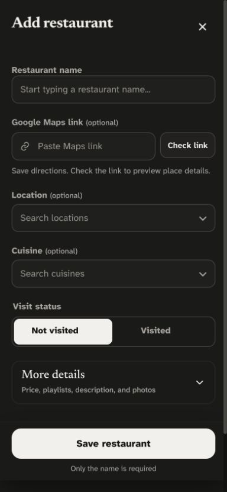

The 320px light form also fits without horizontal overflow. The dialog measured 320px client width and 320px scroll width.

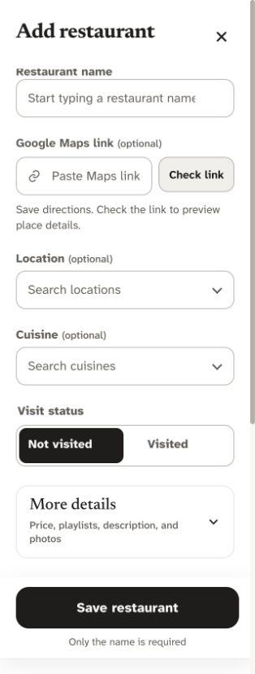

### 2. Optionally check Maps — Good

A synthetic full Maps URL produced a preview with name and coordinates, an explicit Apply details action, and a clear empty-fields-only explanation. The URL remains optional. This run did not test live shortened-link redirects or Google network failures.

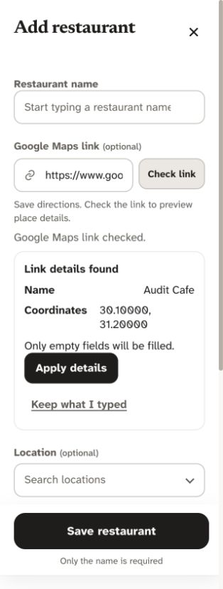

### 3. Select Visited and add a personal review — Good

Visited exposes personal rating/review separately from shared restaurant description. The visible hint explains that a written review requires a rating. Closing and reopening recovered the unfinished review and selected visit status. Keep this conditional structure.

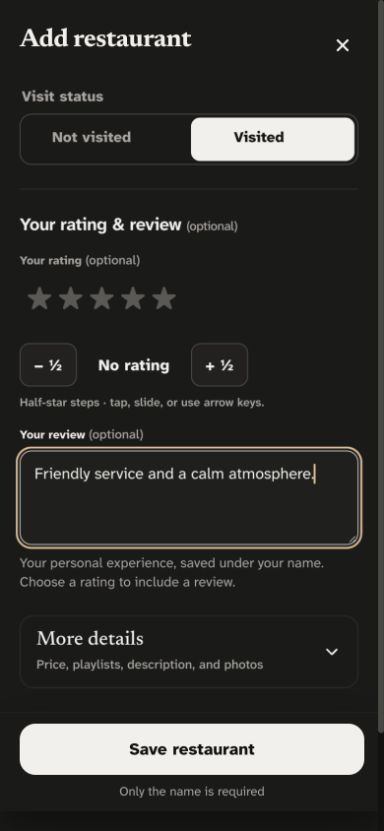

### 4. Expand More details and choose price — Needs correction

The flat disclosure and four readable price tiles work visually. However, Price is labeled optional while Casual is already selected. See finding A.

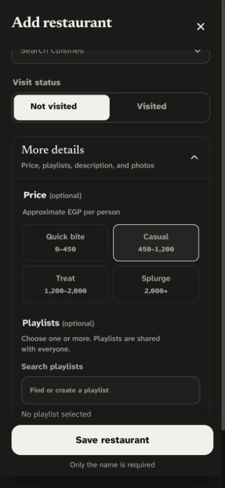

### 5. Choose playlists — Good

Selected Date night, searched for Favorites, and verified that the selected-name summary retained Date night even while its row was filtered out. Clear selection then returned the summary to “No playlist selected.” Keep search, native checkboxes, and selection feedback. This run used the bundled two-playlist catalog; it did not exercise a long list or native touch scroll handoff.

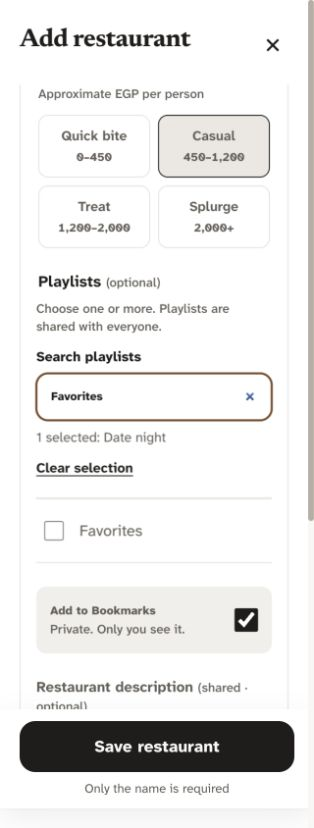

### 6. Correct errors and recover a draft — Good

Submitting without a name displayed “Restaurant name is required” and focused the field. Reopening preserved the draft and offered a distinct Discard draft action. Error and recovery messages are visible without replacing the user's answers.

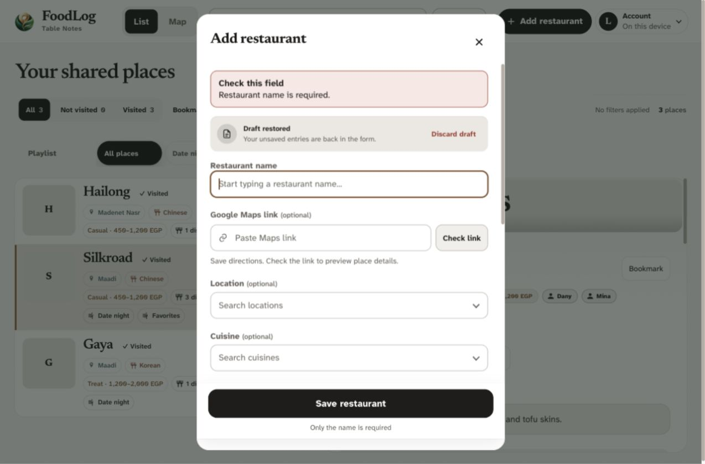

### 7. Save and return to the list — Needs correction

A disposable restaurant saved successfully and offered Add a dish, Add photos, and Done. Its row appeared immediately. The untouched price was saved as Casual, and the visit/playlist counts temporarily contradicted the new row. See findings A and B.

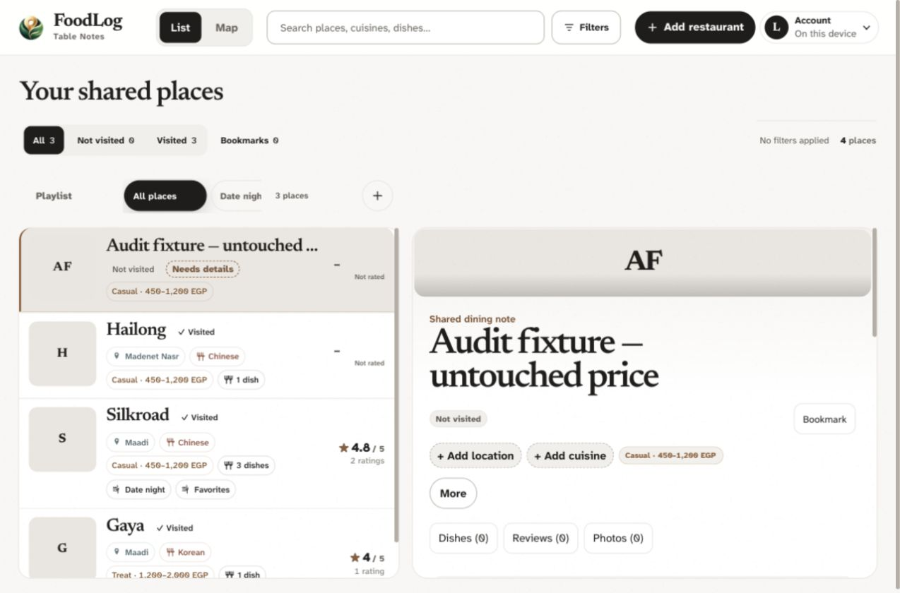

## Prioritized findings

### A. P2 — Optional price silently adds an answer

- **Evidence:** Step 4 preselects Casual. A name-only local save in step 7 displays “Casual · 450–1,200 EGP” despite no price choice. `app.js:6147` falls back to `$$`; `app.js:6292` saves the hidden price input.
- **Impact:** Users saving an unvisited place can accidentally publish an invented price band, affecting discovery and price filters. There is no unknown/reset choice.
- **Recommendation:** New restaurants should start with price unspecified. Add a quiet “Not sure yet” or Clear price action while keeping the existing four tiles. Preserve previously saved price bands and explicit draft choices. Check storage normalization and constraints before implementation; this audit does not establish whether schema work is necessary.
- **Category:** Implementation integrity / form UX. Suggested Impeccable route: harden, then polish.

### B. P2 — Counts do not immediately reflect a new restaurant

- **Evidence:** Step 7 shows four restaurant rows and “4 places,” but All and All places still show 3, and Not visited shows 0 despite the new Not visited row. After a reload, the current DOM showed All 4, Not visited 1, All places 4, and Unsorted 2. The record persisted correctly.
- **Impact:** Contradictory navigation feedback can make a successful save look incomplete. Verified in local-only mode; live cloud behavior remains unverified.
- **Recommendation:** Refresh visit and playlist counts from the updated active records on save, including any render-cache invalidation. Verify local and mocked cloud save paths, without production test writes.
- **Category:** Implementation integrity / navigation feedback. Suggested Impeccable route: harden, then polish.

No P0/P1 issue was established in the observed flow. These are behavior corrections; there is no evidence supporting a broader visual overhaul.

## Technical checks and limits

| Dimension | Current evidence | Assessment |
|---|---|---|
| Accessibility | Visible labels, named controls, focus after missing-name error, retained input; Close and Check link measured 44px tall | Promising; no full conformance score |
| Performance | Production build succeeded; no runtime profiling | Unscored |
| Responsive layout | Inspected 320/390px phone and 1280px desktop views; no observed form overflow | Good in sampled views |
| Theming | Inspected dark phone and light phone/desktop captures | Coherent in sampled states; no new contrast audit |
| Implementation integrity | Product-specific capture flow; two verified behavior issues | Correct those issues, retain design |

At 390px, name/location/cuisine inputs measured 48px tall, Save 52px, and price labels 64px. Check link measured 44px, which corrects an earlier 48px statement in DESIGN.md. Tiny visually hidden radio inputs were not treated as tiny touch targets: their associated labels are the interaction surface.

The static Impeccable detector returned zero primary findings and 30 broader advisories. Its source-pattern shadow/border warnings do not establish a defect in this form and were not promoted to findings without evidence. Detector output is not an accessibility or performance certificate.

No physical-device keyboard/swipe test, screen-reader session, non-Chromium test, live authenticated save, photo upload, long-catalog scroll check, or runtime performance profile was performed in this run. Earlier tests are not counted as current audit evidence. The isolated local preview used bundled fixtures and a disposable restaurant; it had no cloud credentials. The temporary browser tab and server were closed after the audit.

Recommended sequence: correct A and B with focused mocked/local regression coverage, then use Impeccable polish to check the resulting states. Keep the current visual system and all existing data.

## Implementation follow-up — completed locally

Dany authorized the recommended corrections and removal of Check link if it could be replaced with a better flow. The preceding audit remains a record of the original evidence; findings A and B are now resolved in the working tree.

- **Price:** new entries select Not sure yet, stored as an empty string. The four tier tiles retain their original codes. The separate native radio clears a chosen tier, has a 44px label target and a 20px control, and stays on one line. Unknown prices have no metadata tag. Existing saved tiers, nonstandard historical text values, and explicit older draft prices are preserved. An explicit price-only draft now survives closing before entering a name.
- **Counts:** the filter render fingerprint now includes active membership, playlists, location/cuisine, visit status, and private Bookmark state. Local and optimistic cloud saves refresh navigation immediately, without waiting for a full remote reload. Photo-only changes avoid unnecessary filter rendering.
- **Maps:** removed the default Check link button and expanded the input to full width. Complete Google Maps URLs preview after a 500ms typing pause or on blur; full URLs parse locally and short links use the existing resolver. Apply remains explicit and fills only empty answers. Retry link appears only after failure. Typing/closing/success clear scheduled checks and abort in-flight work; stale responses cannot replace newer input. Restored and shared links also preview automatically.
- **Lookup positioning:** a new timing regression reproduced a 165px detachment when a late Maps preview arrived with the location menu open. Repositioning open restaurant lookup menus after preview/status layout changes fixed it on both browser test profiles.

The repository schema uses a non-null text price column; the existing RPC/import functions use `coalesce(price, '$$')`, which preserves an explicitly supplied empty string. No migration, historical backfill, production write, permission change, or deployment was performed. The cloud test used a mocked client and held the post-save reload to verify the empty price payload and immediate counts. Live database acceptance remains unverified.

Validation:

- Production build and 127 unit/source checks passed.
- First restaurant/Maps/form/price suite: 66 passed.
- Surrounding Maps/price/lookup/scroll/playlist suite after sizing correction: 90 passed, 4 platform-specific skips.
- Reproduced Maps lookup-positioning regression: failed on both profiles before the fix; after the fix, 6 focused anchoring/existing-autofill checks passed.
- Final Maps/capture/navigation/review suite: 52 passed, including the price-only draft test. These suite counts overlap; they are not a unique-test total.
- Responsive and Axe checks covered 320/390/515/1280px in both themes. Current local visual captures inspected below. Static Impeccable scan: zero primary findings and 30 broader advisories. Whitespace/diff checks passed.

Physical-device behavior and live authenticated/cloud/Google-redirect behavior remain outside this verification. All automated fixture traffic was local or mocked; external requests were blocked. Documentation updated in PRODUCT.md, DESIGN.md, HOW_IT_WORKS.md, REGRESSION_GUIDE.md, and thought_Process.md.

### Current visual evidence

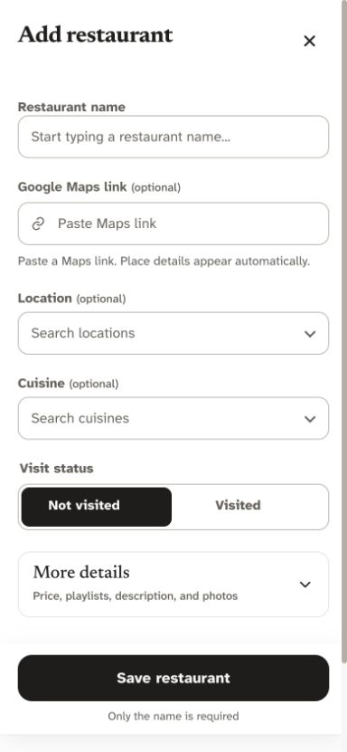

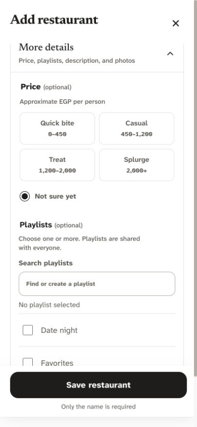

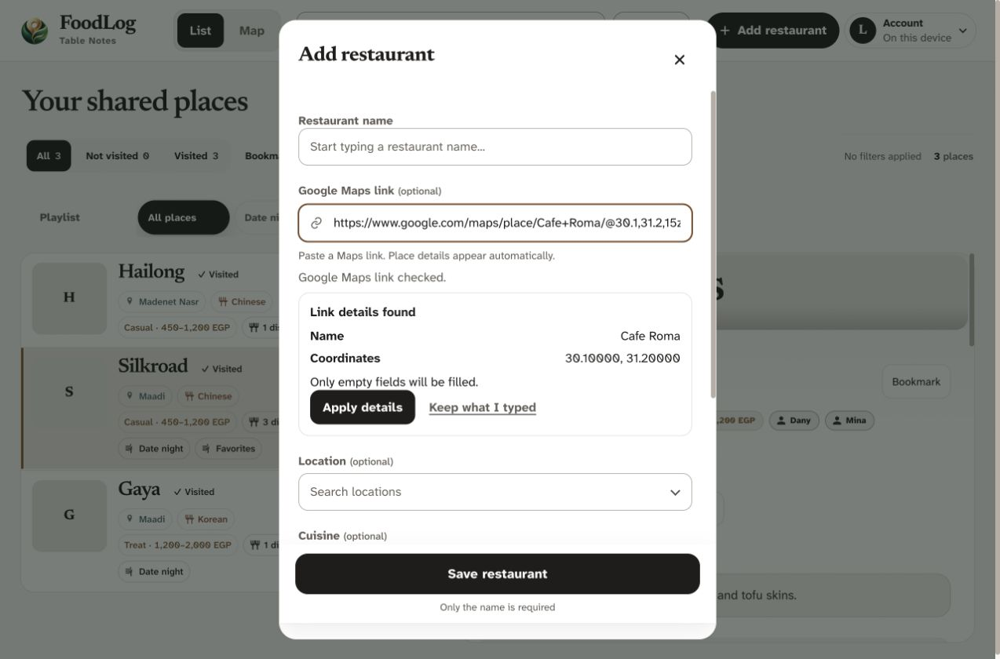

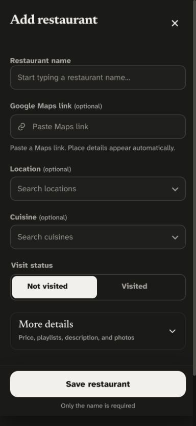
