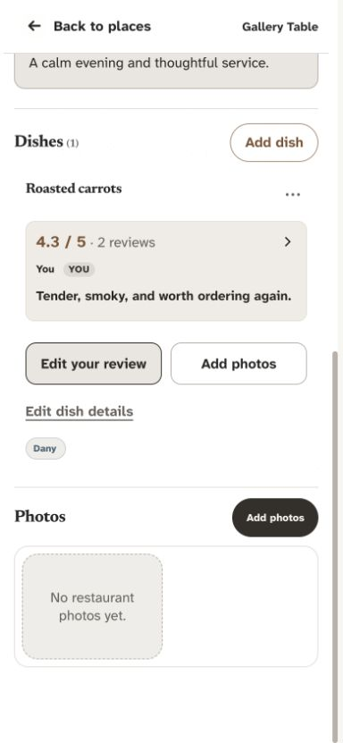
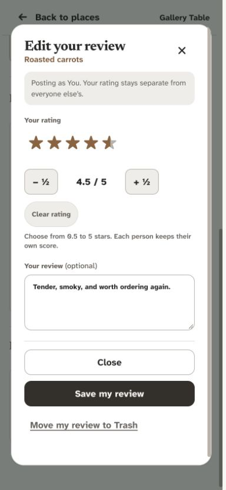
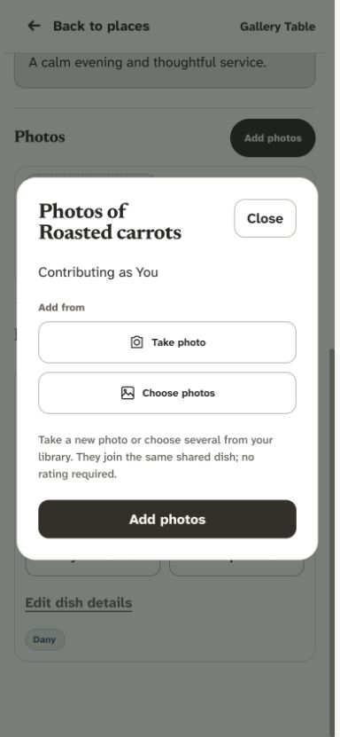
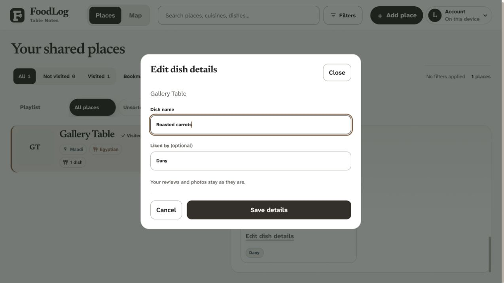
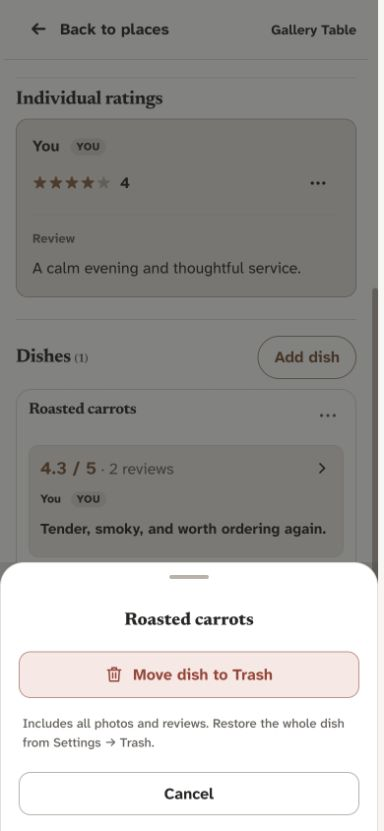
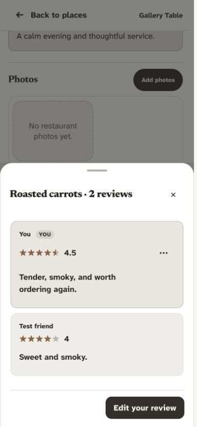
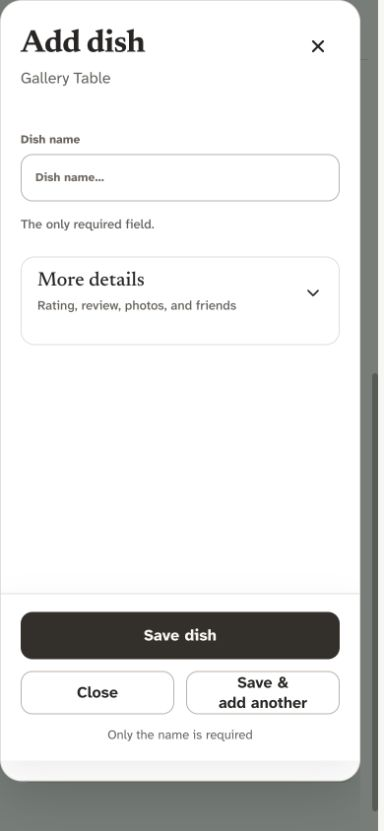

# Dishes UX audit — 3 October 2026

The dish section now separates each task: review editing, photo contribution, and dish details each open a dedicated dialog. The dish header's More menu contains only Move dish to Trash. Dish creation retains its single-page capture form. No production records, permissions, schema, or storage objects were changed.

## Scope and research

Audited the current app using disposable restaurant/dish fixtures in the in-app browser, with desktop and 390px phone captures. Automated checks additionally cover 320px layouts, both themes, keyboard behavior, mocked cloud failures, offline synchronization, ownership, and recoverable deletion. The existing warm white/charcoal palette, restrained bronze accents, typography, and zoom lock remain.

Used the installed Impeccable, Product Design audit, frontend UI engineering, and Supabase guidance. Research informed the implementation choices:

- [Nielsen Norman Group: contextual menus](https://www.nngroup.com/articles/contextual-menus/) supports keeping contextual commands relevant and making important actions discoverable beyond hidden gestures. Applying this to FoodLog, review and photo contributions remain visible, dish details has a quiet visible control, and More has one whole-dish command. This is a product-specific choice, not a universal rule for every menu.
- [W3C modal dialog pattern](https://www.w3.org/WAI/ARIA/apg/patterns/dialog-modal/) describes focus containment, Escape, visible close controls, and returning focus to the opener or a logical replacement. The shortcut dialogs retain native dialog behavior and return focus after card rerenders.
- [GOV.UK button guidance](https://design-system.service.gov.uk/components/button/) supports explicit destructive wording, confirmation, and restrained warning styling. Whole-dish Trash explains its scope and restoration before the existing confirmation.
- [Supabase update reference](https://supabase.com/docs/reference/javascript/update) supports filtered updates and returning the affected record. The details editor updates only the selected dish's name, liked-by list, and audit metadata; reviews and photos are excluded from its payload.

## Captured flow and findings

### 1. Find a dish and choose an action — improved

The card has visible Add/Edit your review and Add photos actions. Existing rating summaries open the individual reviews. Dish owners and administrators have a quiet Edit dish details control; contributors can still edit their own review on someone else's dish. Actions have consistent 48px minimum heights, equal columns, and a 10px gap, stacking below 360px. Empty metadata spacing is removed.

The prior menu mixed dish editing, personal-review deletion, and whole-dish deletion (P1: ambiguous scope). Moving details to a visible dedicated control and keeping personal-review actions with that review resolves this distinction.

### 2. Add or edit a review — healthy, hardened

The current checkout already had a dedicated dish review dialog. This audit did not find that the direct review shortcut opened the general Add dish form. Verified direct card, review-list, and personal-review menu entry points; they all stay within review scope. The restaurant review shortcut was also checked and remains separate from restaurant creation.

Fixed closing focus returning to the rating summary after entering from the card (P2). Direct entry now returns to its review button; entry from the review list returns to the rating summary. Busy review inputs are locked while saving, and draft-storage failure reports that the writing needs to remain in the open window instead of claiming it was saved. Editing preserves other authors' reviews, dish details, and photos.

### 3. Add photos — improved

The photo shortcut remains photo-only: camera/library controls and Add photos, with no review, dish-name, or restaurant fields. The original phone presentation inherited the general capture layout and sat flush against the viewport (P2). It now uses a bounded dialog with 24px padding and 20px internal gaps, a visible Close action, and no blank status-row spacing. Closing returns focus to Add photos, including after a card rerender. Existing background upload and retry recovery remain.

### 4. Edit dish details — improved

The previous Edit dish details command opened the general dish capture form, exposing unrelated review/photo controls (P1). The new dedicated editor contains only Dish name and optional Liked by, with Cancel and Save details. Similar-name protection remains: a likely duplicate requires explicit confirmation that this is a separate dish. Inline errors preserve typed values for retry.

Cloud saves use a partial update filtered by dish ID, restaurant ID, and active deletion state. Offline edits join the existing device save queue, including merging into a queued unsynced dish creation when needed. The editor never replaces review or photo arrays. Existing ownership and database policies remain authoritative.

The phone footer was subsequently corrected to equal full-width buttons with Save first. Its final geometry was verified automatically at 320px in both themes; the final phone footer was not captured again.

### 5. Open More and move the whole dish to Trash — improved

The dish header More menu has one command, Move dish to Trash, plus Cancel. Its explanation includes every photo and review and points to Settings → Trash for restoration. Desktop uses an anchored compact menu; phone retains a bottom sheet. Existing confirmation and permission checks remain.

This is recoverable soft deletion of the parent dish. All nested photos and reviews disappear with it and return together on restore; their records and stored image bytes are retained. The command does not permanently erase existing data. Personal-review Trash remains in the dedicated review editor and the author's review actions.

### 6. Browse individual reviews — healthy, spacing improved

Rating summaries retain the full review list and its visible review shortcut. Names can wrap without pushing scores or controls out of the card; narrow layouts separate author and score rows. The author's Edit/Trash actions remain specific to their review. Existing long-press access remains available alongside visible controls.

### 7. Create a new dish — healthy, preserved

Add dish still opens the single-page name-first capture form, with optional More details and Save & add another. Creation groups initial details, review, and photos; focused shortcuts no longer reuse that form to edit an existing dish's details. Existing drafts and duplicate checks remain.

## Validation and limits

- All 122 unit/source checks and the production build passed.
- The full desktop/mobile Chromium suite passed 200 cases with 12 intentional skips before the final small focus/footer refinements. The final dedicated shortcut suite passed all 12 cases after those changes.
- Fixtures verify dedicated field scope, direct/menu review entry, focus restoration, preservation of other authors and contribution drafts, duplicate confirmation, failure/retry, offline/reconnect, and contributor permissions. Existing deletion tests verify cancel, whole-dish hiding, preserved photos/reviews, and complete restore.
- At 320px, the three focused dialogs had no horizontal overflow and no serious or critical axe findings in light or dark mode. Automated checks and screenshots do not establish full accessibility compliance; physical screen-reader and mobile keyboard testing remain outstanding.
- Captured previews use synthetic text and empty photo collections. Photo persistence, gallery interactions, and deletion with photos are covered by disposable automated fixtures, not by current visual captures of real uploaded images. Physical-device uploads and live-cloud writes were not exercised.
- No production data, schema, or permission changes were performed for this audit. Relevant behavior and checks are reflected in PRODUCT.md, DESIGN.md, HOW_IT_WORKS.md, REGRESSION_GUIDE.md, and thought_Process.md.

## Publication status

Dany subsequently requested push. Implementation commit `2aa7c3f` and the preceding signup commit `54ffb90` were pushed to `origin/design2.0` on 3 October 2026. The immediate public health check still reported the prior `9df5aa3` release; the push is confirmed, but live publication was not confirmed at that check. Cloudflare's configured branch build handles deployment.

Before-state evidence from this same run: [dish card](audit-screenshots/2026-10-03/dish-audit-01-before.png), [already dedicated review editor](audit-screenshots/2026-10-03/dish-audit-02-review-before.png), [mixed More menu](audit-screenshots/2026-10-03/dish-audit-03-menu-before.png), and [edge-to-edge phone photo dialog](audit-screenshots/2026-10-03/dish-audit-04-photos-before.png). Additional final desktop captures: [card](audit-screenshots/2026-10-03/dish-audit-09-desktop-after.png) and [More menu](audit-screenshots/2026-10-03/dish-audit-10-desktop-menu.png).
