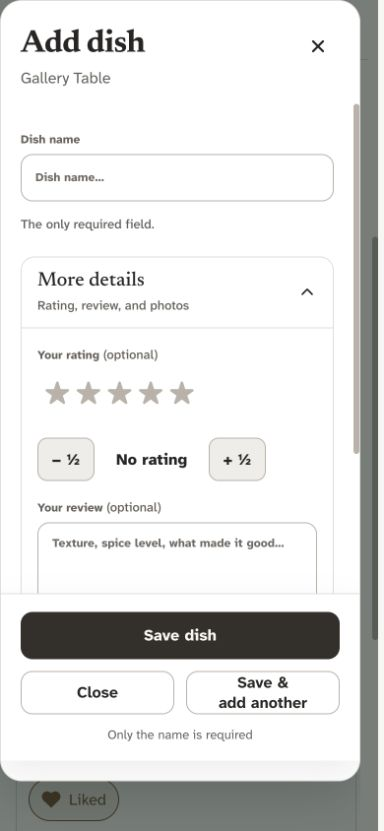
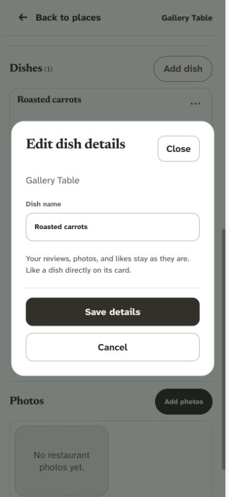
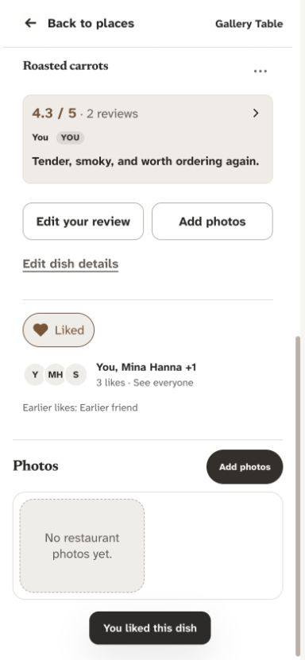
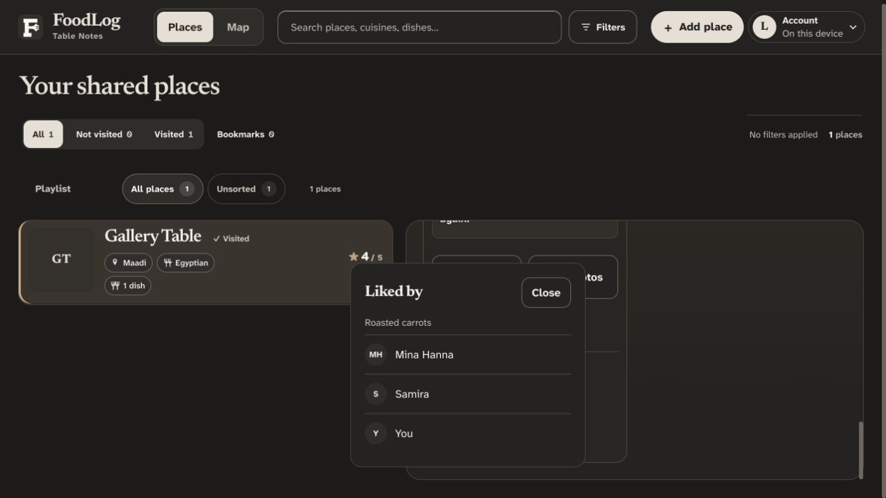
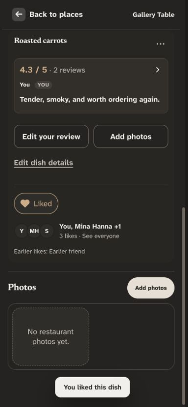

# Account-owned dish likes — 3 October 2026

Production migration applied on 2026-10-03 with Dany's explicit approval; feature implementation `65f40db` pushed to `origin/design2.0`. This replaces editable liked-by names with personal reactions while retaining all earlier names and opinions.

## Audit and direction

The previous Add dish picker allowed arbitrary person names and the details editor accepted comma-separated text. Anyone managing the dish could record an opinion for somebody else; case, spelling, and account identity were not linked. The dish card showed the names without explaining that attribution. This was a correctness problem as well as unnecessary work in the form.

Used Impeccable and UI engineering guidance to extend the existing porcelain/charcoal/bronze design. A compact social row keeps liking close to the dish, separate from creation, reviews, photos, and administrative editing. Avoided a reaction palette: this app needs one clear positive preference rather than several competing meanings.

Research:

- [Slack reaction guidance](https://slack.com/help/articles/202931348-Use-emoji-and-reactions) demonstrates a quick reversible personal reaction and a way to see who reacted. FoodLog adapts that pattern with a visible people summary and tap-accessible list instead of relying on hover or long press.
- [Nielsen Norman Group on state-switch controls](https://www.nngroup.com/articles/state-switch-buttons/) recommends communicating current state and the result of interaction. The outlined/filled heart, Like this dish/Liked wording, and removal tooltip make the choice clear without relying on color alone.
- [W3C button pattern](https://www.w3.org/WAI/ARIA/apg/patterns/button/) describes keyboard operation and `aria-pressed` for toggle state. The accessible label stays stable while the visual state changes. The people panel is non-modal and supports Close, Escape, and light dismissal.
- [Supabase RLS guidance](https://supabase.com/docs/guides/database/postgres/row-level-security) supports explicit read/write boundaries. Existing dish update permissions allow only dish managers, so personal likes need a separate account-owned record rather than rewriting the dish's shared name array. Reviewed the current changelog and read-only production approval/policy definitions; the new table and function were absent during the initial audit, then added during the authorized rollout below.

## Implemented flow

1. **Create a dish — simplified.** The name-first form retains optional rating, review, photos, drafts, duplicate protection, and Save & add another. There is no editable person picker. Earlier drafts can still carry their previously recorded names through the hidden compatibility field. Restaurant Visited by remains unchanged.

   

2. **Edit details — simplified.** The focused editor contains only Dish name. Saves exclude `liked_by`, ratings, and photos; earlier names and account reactions are preserved.

   

3. **Express a personal preference — improved.** Each approved contributor can like any active dish, including someone else's, without gaining dish edit/Trash rights. A 44px heart-and-text control sits alongside group initials, names, and a count. The current person appears first. Requests show Saving and prevent double submission; failures offer retry. Cloud reactions require a connection and are not silently queued. Local-only mode keeps the existing single-device identity and rolls back if storage fails.

   

4. **See who liked it — improved.** See everyone opens an anchored native popover with display names and initials. It stays within the viewport and scrolls for longer lists. No public email is required. Earlier manually entered names remain visible as Earlier likes, separate from the count of account reactions. The app does not guess that an earlier name belongs to a particular account.

   

5. **Undo a like or restore a dish — verified.** Pressing the selected heart removes only the current person's active reaction. Other people's preferences and the dish's review/photo content remain intact. Whole-dish or restaurant Trash hides active reactions; restoring the parent brings them back. Unlike retains its database row with `liked=false` rather than erasing attribution history.

   

The desktop reaction area is also captured in [the final desktop screenshot](audit-screenshots/2026-10-03/dish-likes-02-desktop.png). That view shows the reaction area within the existing scrolled restaurant panel; the entire dish card is visible in the phone capture.

## Data and rollout

The additive migration is [20261003210000_account_dish_likes.sql](../supabase/migrations/20261003210000_account_dish_likes.sql). It adds:

- `dish_likes`, keyed by dish ID and authenticated account ID, with display name, state, and timestamp.
- A public-read policy limited to active reactions on active dishes/restaurants. Clients receive SELECT only, with no direct INSERT/UPDATE/DELETE grant.
- `set_dish_like(dish_id, liked)`, a narrowly scoped authenticated function that requires the existing editing approval, derives the account/name, locks active parent records during the transaction, and changes only the caller's preference. User metadata supplies display text, never authorization.
- An identity-free `dish_like_changes` signal published through the existing Supabase realtime publication. Unlike hides the inactive reaction row from public reads, so clients subscribe to this separate signal to refresh counts reliably.

There is no update, deletion, or backfill of existing dishes, liked-by arrays, reviews, or photos. Composite identity prevents simultaneous friends from overwriting each other's preferences; repeated desired-state requests do not duplicate reactions. Earlier names remain historical because there is insufficient evidence to assign them to accounts safely.

JSON exports retain account likes. Cloud imports preserve their names as Earlier likes on the imported copy instead of impersonating accounts. Local imports preserve their local snapshot. Existing production records are not rewritten by this change.

Dany explicitly approved migration and publication. Applied the exact saved migration through Supabase, recorded as `20261003203516_account_dish_likes`; schema/grants are verified and feature implementation `65f40db` is pushed to `origin/design2.0`. The UI tolerates a missing likes table without blocking collection loading and reports unavailable reaction writes clearly. Do not release the new reaction UI before its backend is ready. Rolling the frontend back leaves both earlier names and new reaction rows intact.

## Verification and limits

- 126 unit/source checks and the production build passed.
- Full desktop/mobile Chromium suite: 214 passed, 12 intentional skips before the final realtime signal refinement; all 14 focused likes cases passed afterward. Coverage includes creation, details, review/photo preservation, approval, double clicks, failure/retry, offline handling, realtime refresh, local quota failure, whole-dish restore, and unavailable migration. Existing typed-name assertions were updated to verify the replacement workflow; a menu geometry assertion now waits for its entrance animation to settle.
- The rollback-only SQL test [dish_likes_local.sql](../supabase/tests/dish_likes_local.sql) passed in a new disposable local PostgreSQL database. It verifies repeated requests, own-account attribution, other-person preservation, unapproved forged metadata, anonymous/direct-write denial, parent Trash/restore, retained unlike rows, and unchanged hashes of original dish/review data. All fixture records and DDL were rolled back.
- 320px people-panel checks in both themes reported no serious/critical axe findings or horizontal overflow. Existing focused editor accessibility checks also passed. Final desktop and 390px phone screenshots were inspected in bounded batches, including the final refinement to put the current person first and avoid duplicate You labels.
- Production was inspected read-only for policy/function compatibility, object absence, and the existing realtime publication. No production changes were performed during local verification; the later authorized migration and preservation checks are recorded below. No production fixture records or account likes were created. Physical-device, screen-reader, and real-cloud write verification remain outstanding; local tests cannot prove those outcomes.

Product behavior and regression expectations are updated in PRODUCT.md, DESIGN.md, HOW_IT_WORKS.md, REGRESSION_GUIDE.md, and thought_Process.md.

## Authorized production rollout

- Applied the additive migration after Dany approved migration and push. Both tables have RLS and public/authenticated SELECT only; authenticated callers use the own-account function, anonymous execution is denied, and the function retains its fixed empty search path and existing approval guard. Composite primary keys, foreign-key indexes, and the realtime change publication were verified. Both new tables were empty immediately after rollout.
- Before/after row counts and whole-row aggregate hashes matched for all 20 existing public app tables. The existing approval function and all 68 existing public policies also matched. Existing liked-by names, reviews, photo references, and Trash records were preserved. No storage objects were modified.
- Database advisors flag the intentionally authenticated security-definer write gateway ([Supabase advisory](https://supabase.com/docs/guides/database/database-linter?lint=0029_authenticated_security_definer_function_executable)). This is required for a tightly scoped own-account write without direct table write grants; approval and identity checks were locally tested and the production definition verified. The two new foreign-key indexes are understandably unused before first use ([index advisory](https://supabase.com/docs/guides/database/database-linter?lint=0005_unused_index)). Other project advisories remain outside this change.
- Feature publication `65f40db` is confirmed on `origin/design2.0`; deployment follows the configured Cloudflare branch build. Live authenticated writes remain untested to avoid creating production test records.
