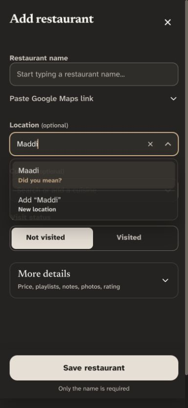
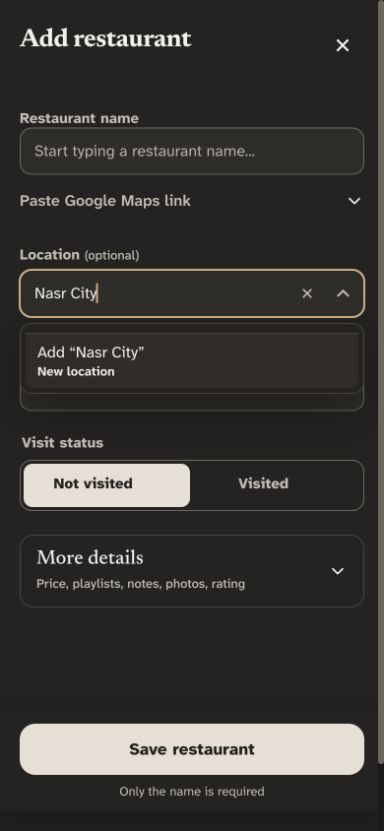
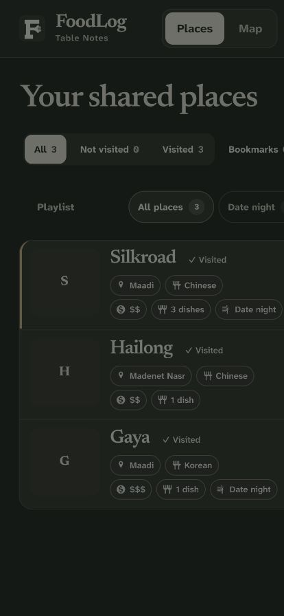
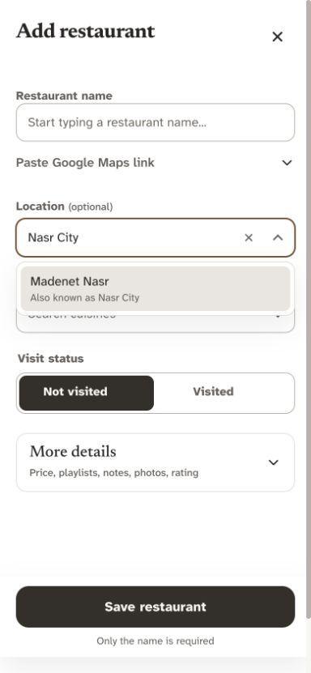
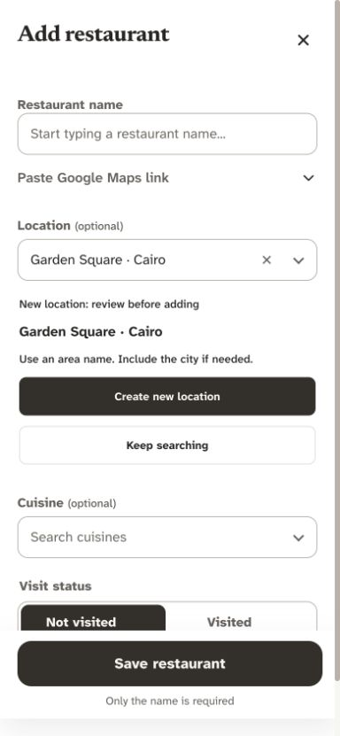
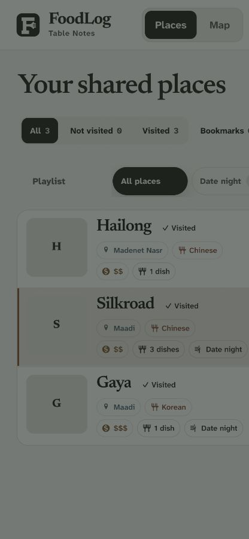

# Location and cuisine selection audit — 2026-10-03

Status: app improvements implemented and locally validated; additive database migration applied with Dany’s explicit approval on 2026-10-03. Original audit baseline: `386b0e1`. Before/after row counts and content hashes match for all 18 existing app tables; no existing records were rewritten or removed.

## Recommendation

Keep searchable selection and a deliberate route for missing entries. Do not remove creation entirely: a restaurant in a genuinely new area or with a missing cuisine should not become impossible to describe. Stop treating any unrecognized text as an implicitly accepted new shared label.

Use one preferred display name per entry, with searchable aliases. Locations should represent areas, not street addresses; city context can distinguish identically named areas. Cuisines should use a maintained list of familiar categories. Start with the current approved-editor creation permissions and stronger confirmation; moderation or an admin-only cuisine request workflow is a separate product decision, not a prerequisite.

## Evidence and findings

The implementation already has searchable comboboxes, recent-choice ordering, clear buttons, keyboard selection/Escape, viewport-aware top-layer popovers, normalized exact matching, and fuzzy suggestions. Preserve these.

| Priority | Verified finding | Consequence |
| --- | --- | --- |
| P1 | `resolveLookupValue` only requires an explicit decision when a fuzzy suggestion exists. A value with no match is valid even without selecting the Add row. Full Add/Edit and quick metadata use this resolver. | Typing and saving can unintentionally create a new shared term. |
| P1 | `findSimilarLookupValues` returns no match for `Nasr City` or `مدينة نصر` against `Madenet Nasr`. The local mobile picker offers only Add “Nasr City”. | Alternative names can split one area into separate filter choices. |
| P1 | Repository lookup tables use text names as primary keys; the restaurant trigger registers trimmed strings. Restaurant imports/save RPCs also accept strings. No alias/canonical-ID contract was found in the reviewed files. | UI checks do not enforce one identity across imports, stale clients, or concurrent additions. Live schema was not inspected. |
| P2 | Similar suggestions are limited to three by the matcher, but the renderer presents only the first fuzzy suggestion unless others also match the substring query. | An ambiguous typo can hide useful alternatives. |
| P2 | New-entry status is hidden for inputs shorter than three characters; fuzzy matching requires both strings to have at least four characters. | Short names/abbreviations receive weaker guidance. Length alone should not decide validity. |
| P2 | `mergedLookupOptions` groups normalized display choices, while restaurant filters compare stored strings exactly. | Hiding spelling/case variants in the list does not clean the underlying records or guarantee complete filtering. |

Source anchors: `app.js` functions `mergedLookupOptions`, `renderLookupCombobox`, `resolveLookupValue`, `registerLookupValues`, `saveRestaurant`, and quick metadata submit; `lib/foodlog-core.js` normalization/matching; `supabase-migration-lookups.sql`; `supabase-migration-playlists.sql`; save/import migrations. These findings concern data quality, not a claim that every similar label is a duplicate.

## Proposed user flow

1. Tap **Location** or **Cuisine**. Show recent existing choices followed by the full searchable list. Keep fields optional.
2. Search by preferred name, known alias, or spelling variation. Rank exact/alias and prefix matches before substring and fuzzy suggestions. Show city context for areas where needed.
3. Tap an existing result to select its preferred name. Example: searching `مدينة نصر` finds **Nasr City · Cairo**, after that alias has been reviewed and registered.
4. If nothing fits, show **Can't find it? Add a new location/cuisine** as a visually separate action. Do not make creation the default selected Enter result. Show a clear empty-results message and let the user leave the optional field blank.
5. Explicit creation previews the proposed label and any close matches. Prefer **Use existing** when appropriate; allow **Create new** for a genuinely different entry. Never silently replace a fuzzy match or merge broad/specific cuisines such as Asian and Chinese.
6. Saving resolves to the selected canonical entry. A simultaneous equivalent creation returns the existing entry rather than another duplicate or an unexplained error.

For cuisines, a curated starting list and reviewed aliases should remove most need for new entries. For locations, controlled spelling plus city context handles growth better than a permanently closed list. Arabic and English variants need maintained aliases, not an assumption that string similarity provides translation.

## Dropdown assessment and research

The existing searchable combobox is a suitable foundation. Replacing it with a long native select would make finding a known area/cuisine harder. The Home Office recommends autocomplete for long lists, including substring search, understandable ordering, synonyms, match counts, clear controls, and ongoing list maintenance. [Home Office long-list guidance](https://design.homeoffice.gov.uk/design-system/patterns/help-users-to/long-lists)

GOV.UK warns that selects can be difficult and recommends reducing choices where possible. This supports improving search and suggestions rather than assuming any dropdown is universally the best UX. [GOV.UK select guidance](https://design-system.service.gov.uk/components/select/)

Retain the anchored dropdown on desktop. On phones, first validate the existing visual-viewport behavior with the real keyboard open and a longer fixture list. If too few results remain visible, test a dedicated search sheet that presents one result per generous row. Do not introduce an extra sheet solely for animation or appearance. Desktop viewport emulation does not establish phone keyboard usability.

Keep labelled combobox/listbox semantics, Arrow navigation, Enter acceptance, Escape dismissal, focus retention, and screen-reader announcements of match counts and errors. W3C documents these interaction requirements; the current presence of ARIA attributes is not proof of assistive-technology correctness. [W3C combobox pattern](https://www.w3.org/WAI/ARIA/apg/patterns/combobox/)

## Implementation plan and tools

**First pass:** use the existing vanilla JavaScript component and matcher; add explicit creation state, multiple helpful suggestions, alias lookup, clear selected/new states, and consistent validation in full Add/Edit, quick metadata, and Maps-assisted capture. Keep optional blank values and drafts. No new search library is needed at the current demonstrated scale.

**Durable data protection:** introduce stable lookup IDs, preferred labels, reviewed aliases, and a normalized uniqueness key (with location context where appropriate). Enforce identity at the server boundary and resolve IDs in filters, imports, exports, and offline reconciliation. PostgreSQL supports unique expression indexes for normalized equality and foreign keys for valid references; neither detects semantic duplicates by itself. [PostgreSQL expression indexes](https://www.postgresql.org/docs/current/indexes-expressional.html), [PostgreSQL constraints](https://www.postgresql.org/docs/current/ddl-constraints.html)

**Existing data:** produce a read-only duplicate/alias mapping preview. Dany should approve uncertain merges and preferred names before a production migration. Retain old names as aliases and preserve restaurant associations. Do not auto-merge different districts, branches, or distinct cuisine categories. This audit does not assert how many production duplicates exist.

Use existing Vitest/Playwright fixtures for normalization, deliberate creation, aliases, ambiguous matches, concurrent creation, imports, keyboard behavior, long lists, and failure recovery. Add screen-reader and physical-phone checks before claiming the picker is the smoothest option. Measure task completion, wrong selections, unmatched searches, and duplicate creation with consenting local usability sessions before considering external telemetry.

## Verification and scope

- Existing lookup safety browser test passed on desktop Chromium and emulated Pixel 7: **2 passed**. This proves the currently tested typo flow; it does not prove all typos are prevented.
- Direct matcher checks: ` MAADI ` → exact Maadi; `Maddi` → suggested Maadi; `Mdi`, `Nasr City`, and `مدينة نصر` → no match against the fixture names.
- Inspected local dark-mode picker at 390×844 and 1440×900. No physical keyboard/device, screen reader, production schema, or production dataset check.
- Impeccable 4.5.0 static scan of `index.html` and `app.js`: 0 primary anti-patterns; 33 advisory notes. This scan does not check taxonomy correctness and cannot clear the data findings above.
- Technical health within this narrow scope: accessibility 3/4 (keyboard path tested, assistive technology unverified); performance 3/4 (local matching, large-list scale untested); responsive design 3/4 (emulated views inspected, real keyboard unverified); theming 3/4 (neutral dark capture inspected, no full contrast audit here); implementation integrity 2/4 (creation/identity gaps). **14/20**, provisional scoped assessment, not an app-wide accessibility certification.

Evidence:

Suggested next commands: `$impeccable shape` for selection/creation states, `$impeccable harden` for shared validation and edge cases, `$impeccable adapt` if physical mobile checks justify a sheet, then `$impeccable polish`. These can be run together or separately after the proposal is accepted; re-run the scoped audit after implementation.

## Implementation follow-up

- Implemented deliberate Add → inline preview → Create new, required for every unrecognized nonblank value, including short names. Creation is not the default Enter choice. Keep searching restores input focus; typing a different identity revokes confirmation. Existing selection and blank optional fields remain fast.
- Added a shared catalog module with conservative exact identity, Arabic/English aliases, city context for known areas, twenty familiar cuisine choices, ranked search, multiple close suggestions, readable wrapping, clear empty-result wording, and live result counts. Alias collisions with distinct existing entries stay separate.
- Full Add/Edit, quick metadata, Maps-assisted capture, and restored drafts share the guard. Quick-dialog cancellation resets creation state. Keyboard Enter now activates focused buttons normally.
- Filters include normalized historical spellings and registered aliases. Imports preview exact changes, drop source-registry IDs, and preserve uncertain terms; local merge/replace assigns destination identities. Exports include available IDs. Public catalog metadata is cached for offline search; older servers remain supported.
- Prepared an additive migration with UUID entries, normalized uniqueness, aliases, FK columns, and private table triggers for canonical saves/imports/legacy lookup inserts. Concurrent fixture writes share one ID and label. Existing restaurant history/text is not bulk rewritten. Server protections are now active after the approved production application.
- Read-only production inspection confirmed ten location and twelve cuisine labels. Saved the [name-review preview](LOOKUP_NAME_REVIEW_2026-10-03.md); uncertain corrections and geographic/category merges remain unapplied.
- Unit/syntax checks: 119 passed. Full browser regression passed 153 tests/11 skips before the final additional coverage; the expanded run passed 157/11 skips with two viewport-fixture failures, subsequently corrected and rerun separately. Final targeted results are recorded in the project log. Local PostgreSQL migration, identity, alias, boundary, permission and simultaneous-add checks passed; no production test records were created.
- Bounded visual inspection found and fixed the creation button's foreground token. Narrow-screen/light/dark contrast and keyboard tests cover the final controls. Real phone keyboard/inertial behavior and screen-reader speech output remain unverified; no extra mobile sheet was introduced without that evidence.

Follow-up: Dany confirmed New Cairo/tagamo3 equivalence; registry aliases now share New Cairo, with historical restaurant text preserved. Capture/quick metadata have visible Clear actions that retain focus and close suggestions. Owner Settings includes searchable label maintenance, usage counts, rename with retained aliases, recoverable Delete and Restore. Server authorization, narrow-layout contrast, and failed-write recovery were verified; see the project log and rollout document.
