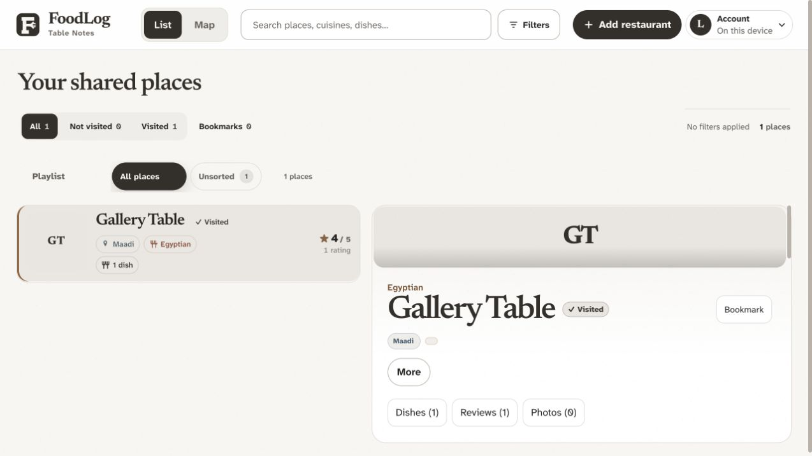
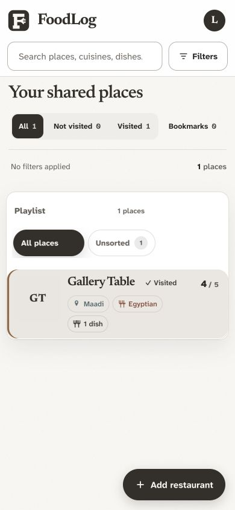
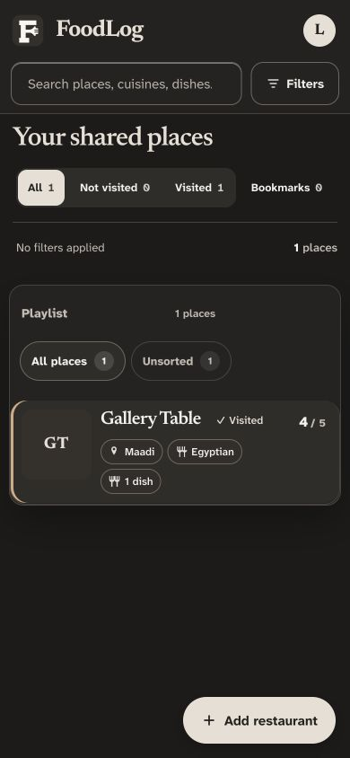
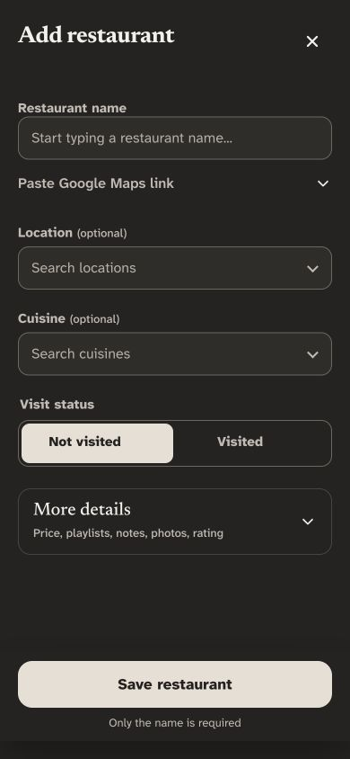

# Places and Add navigation recommendation — 3 October 2026

Status: Dany approved this recommendation for implementation. Implemented and validated locally; captured evidence follows below. No production data, access rules, or deployment changed.

## Evidence

Inspected current index.html, app.js navigation/auth handlers, mobile CSS, DESIGN.md, PRODUCT.md, and release history. Visually inspected the live desktop layout, 390px phone restaurant list, and phone restaurant details. The initially signed-out view subsequently resolved an existing signed-in session; no sign-in action or credential entry was performed. No user records were created or changed.

- Desktop Places switches between the restaurant list/detail workspace and Map; removing its only return control would lose useful navigation.
- Phone hides Map and presents a broad Places + Add dock. On the restaurant list, Places reselects the existing surface; it does not clear filters or provide a separate collection.
- Phone restaurant details already have Back to places. The inspected details view does not display the bottom dock; the return control is therefore the established navigation path.
- Add opens the restaurant form directly. Phone Add appears for approved editors/local mode; desktop Add also offers sign-in guidance for visitors. Approval requirements must remain intact.
- Search, filters, Bookmarks, and playlists already have visible controls. Duplicating them in a new bottom tab would add competing entry points without creating a separate destination.

## Research

- [Apple: Design foundations from idea to interface](https://developer.apple.com/videos/play/wwdc2025/359/), Navigation chapter: tabs represent destinations; Add belongs with the content it creates. This is closely applicable to FoodLog’s collection-and-capture structure.
- [Android: Navigation bar](https://developer.android.com/develop/ui/compose/components/navigation-bar): navigation bars switch among three to five peer destinations. FoodLog’s current phone dock has one destination and one creation action.
- [Android: Floating action button](https://developer.android.com/develop/ui/compose/components/fab): an extended action button supports an icon and visible text. This supports a compact labeled creation control without reserving a full navigation tray.
- [Material: Floating action button](https://m1.material.io/components/buttons-floating-action-button.html): one promoted action per screen, with enough list clearance to prevent covered content. This older guidance is used only for those placement principles, not its historical sizing or animation prescriptions.

Used the installed Impeccable Operate-mode guidance for predictable controls, clear hierarchy, and restrained visual styling. This is scoped product/navigation advice, not a full dual-assessment Impeccable critique command or usability study. No usage analytics or participant testing were available; expected improvements are design judgments to verify during implementation.

## Recommended direction

1. Remove the mobile Places control and the enclosing bottom navigation tray. Do not replace it with another redundant tab.
2. Keep one labeled + Add restaurant pill at the bottom right of the phone restaurant list. Open the existing form directly, with no extra chooser. Use the established charcoal/bronze palette, a 48–52px target, 16px edge clearance plus safe-area inset, and enough trailing list space for the last restaurant to remain accessible.
3. Hide that floating creation action during a dialog, photo viewer, keyboard interaction, or restaurant detail view. Preserve the visible Add dish, Add/Edit review, and Add photos actions in their relevant sections. Avoid a changing unlabeled plus button or a general creation menu.
4. Keep Back to places, browser/device Back, swipe return, prior filters, list scroll, selected restaurant, and focus restoration intact. Preserve deep links and desktop navigation when resizing or returning from a saved Map preference.
5. On desktop, retain both workspace views as a compact List / Map switch, relabeling Places to List. Keep the existing header creation entry and clarify it as Add restaurant.
6. Preserve the current approval gate and explicit account-access controls. Signed-out/unapproved phone visitors get no empty dock or inert floating button. Keep desktop sign-in guidance from the existing creation entry.

## Alternatives considered

- Replace Places with Search: duplicates the visible search field and adds another route to the same task.
- Replace Places with Bookmarks: duplicates the current private filter; reconsider only if saved items later become a separate substantial destination.
- Put Add solely in the top header: a clean alternative, but less convenient to reach with one hand while browsing a long phone list.
- Keep Places + Map + Add on phone: introduces a mobile Map scope change without resolving the action/destination distinction.

## Implementation acceptance checks

Use mocked cloud responses/disposable local fixtures. Check approved/signed-out/pending roles; 320px and 390px phone plus desktop; light/dark; long lists; last-row visibility; keyboard and dialog overlap; returning from details with unchanged filters/scroll/focus; Map/List and deep links; empty/offline/loading states; and existing restaurant drafts/save/photo recovery. No new library or database migration is required.

## Local implementation — 4 October 2026

Implemented the approved direction using the existing form, auth, history, and draft handlers. Retained the existing creation button ID for compatibility, moved it outside navigation, and replaced mobile tray rules with a standalone labeled pill. Desktop creation now says Add restaurant and its List/Map switch stays available. Mobile Map rendering uses the list without overwriting the saved desktop preference; both the workspace and list renderer honor that responsive fallback.

Captured and inspected the desktop and 390px phone layouts in one batched visual pass. Light and dark creation controls have clear labels, reserved list clearance, and no enclosing navigation tray. The direct restaurant form has no additional selection step or floating control overlapping it.

Validation uses local fixtures and mocked cloud responses only. Physical-device keyboard/safe-area behavior and screen-reader use remain unverified. No production schema, approval policy, user record, or deployment change is involved.

Final validation: 126 unit/source checks passed, production build passed, and the complete desktop/mobile Chromium suite passed 222 cases with 12 intentional skips. This includes signed-out/pending/approved roles, direct creation and draft recovery, modal return focus, typing/menu visibility, last-row clearance, unchanged records/filters/scroll, saved Map preferences/deep links/resizing, photo recovery, and dish/review flows. New 320px creation-action axe checks reported no serious/critical findings or horizontal overflow in either theme. Impeccable reported no primary findings and 30 advisory findings in the broader existing styles. `git diff --check` passed. The initial full run exposed the list renderer’s Map early return, now fixed; two 404 fixture failures from a concurrent preview rebuild were resolved by rerunning the complete suite on a stable build.

Implementation is local and ready for publication; no push or production deployment was performed for this navigation change.
