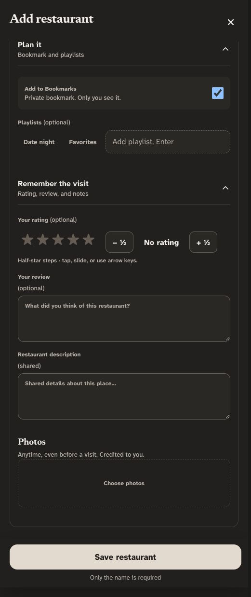
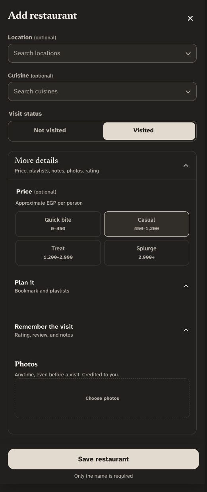
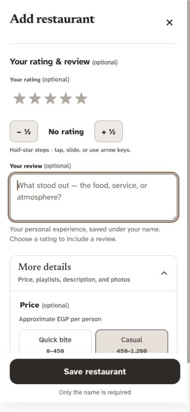
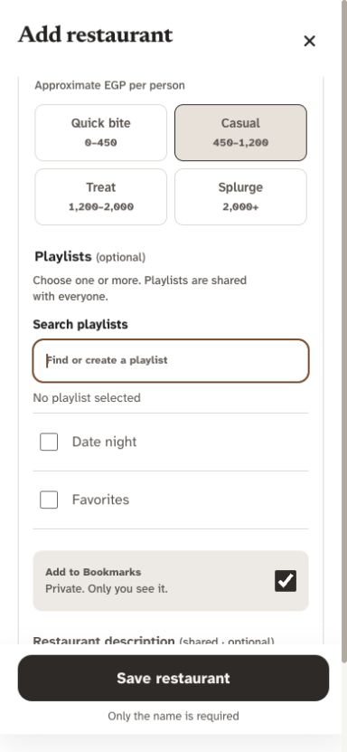
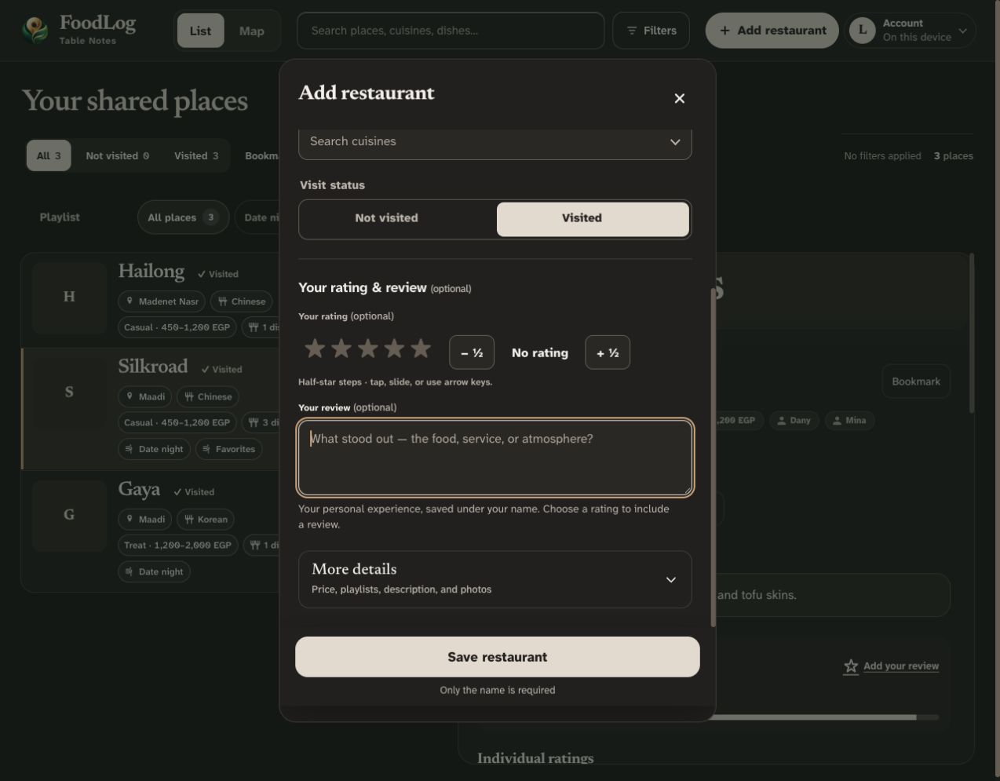

# Add restaurant UX audit and improvements — 4 October 2026

Dany requested clearer visit states, simpler optional details, separation of personal reviews from the shared description, and easier playlist selection. The implemented change retains the Porcelain & Bronze identity, price codes, location/cuisine autocomplete, Maps preview, photos, duplicate recovery, drafts, approval requirements, and reliable save path. No production records, schema, or permissions changed. Dany subsequently authorized Git publication to design2.0; Git publication alone does not confirm live deployment.

## Research and decisions

- [NN/g: Progressive Disclosure](https://www.nngroup.com/articles/progressive-disclosure/) recommends clear labels that explain what follows and warns about excessive disclosure depth. Keep one More details control and remove the nested Plan it / Remember the visit controls.
- [GOV.UK: Radios](https://design-system.service.gov.uk/components/radios/) documents conditional fields related to an answer. Show optional personal rating/review immediately after Visited, without opening another menu. Not visited still permits shared descriptions and photos.
- [GOV.UK: Checkboxes](https://design-system.service.gov.uk/components/checkboxes/) recommends checkboxes for multiple selections, explicit multi-select instructions, and alphabetical ordering. Applying that guidance here: use searchable checkbox rows with stable positions, a bounded list, a selection summary, and Clear selection. Search is an implementation choice for a growing catalog, rather than a claim that every multi-select requires it.
- [W3C: Grouping Controls](https://www.w3.org/WAI/tutorials/forms/grouping/) recommends semantic grouping of related fields. Price and playlists use fieldsets/legends; personal rating/review forms its own labeled section. Supporting descriptions stay outside input labels and connect through aria-describedby.

Impeccable's Operate, distill, craft-floor, and polish guidance informed hierarchy, spacing, restrained color, native controls, and preserving useful functionality. Product Design's audit workflow informed current-screen capture and evidence limits.

## Flow audit

| Step | Before | Implemented result / health |
| --- | --- | --- |
| 1. Enter restaurant basics | Name-first capture, stable lookup menus and persistent Save already worked. | Preserved: name is the only required field; Maps, location, and cuisine remain optional. Healthy in local browser checks. |
| 2. Choose visit status | Both states allowed access to rating and review; selecting Visited opened an inner section beneath a still-collapsed outer disclosure. | Visited reveals Your rating & review directly. Not visited hides and makes these fields inert. Healthy: status switching retains typed answers and drafts. |
| 3. Add optional shared details | Plan it and Remember the visit nested inside More details; shared description sat directly beneath personal review. | One flat More details area: price → playlists → private Bookmark → shared description → photos. Healthy: no extra navigation needed between these fields. |
| 4. Choose/create playlists | Small text pills mixed with an Enter-only text input; selected state was subtle. | Searchable, alphabetically arranged native checkbox rows; visible selected names/count, Clear selection, empty/results messages, explicit Add new action. Healthy under keyboard and fixture checks, including long lists and names. |
| 5. Save, close, or resume | Established safe saves, photo retry, duplicate checks and draft recovery already existed. | Preserved. New safeguards avoid hidden-review loss, retain rating-only drafts, and preserve comma-containing playlist names as array entries. Healthy in local regression checks; live authenticated saves were not exercised. |

### Before: unvisited place still exposes personal review and adjacent description

The current audit captured the old form with Not visited selected and both nested disclosures opened. The two text boxes shared the same visual treatment and appeared together; the playlist creation input communicated an Enter shortcut through placeholder text.

### Before: Visited retains the same nested structure

The visit choice changed the selected segment and inner disclosure state, while the outer optional area still mixed unrelated fields.

### After: separate personal experience

One direct section contains rating and review. Its helper explains authorship and the existing rating requirement. The shared description remains inside More details, with examples of factual information and its About this place destination.

### After: clear playlist selection

Multiple choices use checkboxes with at least 48px rows. Filtering never changes selection; toggling does not reorder neighbors. Enter selects an exact existing name or focuses the explicit Add action for a missing name. New choices are marked as saved with the restaurant, including after draft recovery. Case/Unicode/spacing equivalents reuse an existing name; reserved filter names and locally trashed names are rejected.

### After: desktop and dark mode

## Preservation details

- Switching to Not visited keeps entered rating/review values in the draft. A visible notice explains recovery. Save asks the user to select Visited or explicitly clear those fields; it never silently drops the opinion or saves a contradictory visit state.
- Edit restaurant retains its existing personal rating/review capability and all other authors' opinions. Its historical shared visit state is not overwritten. The private Bookmark control appears for creation; existing-place Bookmarks remain available from the restaurant page. The previous form's edit-mode checkbox was ignored by the save path.
- Untouched creation Bookmarks follow visit intent. Once the user changes the checkbox, status toggles retain that explicit preference. Recovered drafts retain their saved choice.
- Drafts record the single More details state; earlier planOpen/visitOpen drafts still expose the shared fields. Array-based playlist names survive commas through draft recovery and saves. The hidden playlist input remains a compatibility display, not the source of membership parsing.
- Selected playlist filters still seed membership. New form entries become destinations when their restaurant is saved; standalone empty-playlist creation remains on the playlist rail.
- Save and photo queue/RPC behavior, owner approval, Trash, and underlying data schema remain unchanged.

## Validation and limits

- Production build and all **126 unit/source checks** passed.
- Full desktop/mobile Chromium regression: **284 passed, 12 existing skips**, including **22 new form checks**.
- Form accessibility/overflow checks covered 320/390/515/1280px, both themes, and both visit states: 32 local Axe scenarios across the two browser projects. No tested WCAG A/AA violations or horizontal form overflow; this is not a claim of complete accessibility compliance.
- Coverage includes old/new draft recovery, review/description separation, rating-required errors, explicit Bookmarks, comma-containing names, empty/new playlists, normalized duplicates, long catalogs, stable checkbox geometry, and preservation of photos/visit names/other authors' reviews. Existing suites cover Maps, photo recovery, duplicate confirmation, sync, approval, and recoverable deletion.
- Current-run in-app-browser screenshots were saved and inspected. A resize capture that initially retained the prior width was rejected and replaced. The captures use local bundled sample content; automated tests use disposable fixtures and mocked remote responses, never production test records.
- Impeccable static scan: **0 primary findings**, 31 broader style advisories; no suppressions were added.
- Physical-device keyboard/swipe behavior, screen-reader announcements, live authenticated cloud writes, and non-Chromium behavior remain unverified. Existing server-side exact-key playlist uniqueness does not atomically prevent simultaneous normalized spelling variants; no schema change was introduced here.
