# FoodLog UI/UX audit — 2026-10-03

Status: implementation completed locally and validated; included in the authorized push to `design2.0`. The original findings below describe the pre-change audit.

## Palette and spacing follow-up

Dany confirmed the Porcelain & Bronze refinement after rejecting the green-heavy frontend. The effective palette now uses warm white/stone in light mode and neutral charcoal in dark mode, with bronze for ratings/focus. Existing fonts, app structure, behavior, and the page zoom lock stay. The review action sheet has consistent group gaps; narrow review headers wrap long author names separately from stars/actions. Sticky header/title controls share their insets/alignment. Narrow filter footers stack, Undo fits the viewport, and dark Settings/hover contrast is corrected.

Project Impeccable is updated to official 4.5.0, with engine 0.1.11 and unchanged hooks. DESIGN, its sidecar, and the primary-surface brief describe the implemented palette. The detector found only advisory discrepancies in the accumulated CSS (288), including overridden historical literals; no blanket suppressions were added. Final validation: 113 unit tests, bundle build, and 147 browser tests passed; 11 platform-specific tests skipped. New regressions cover long names, 320px gaps, and both-theme color contrast across Places, filters, Settings, review actions/editor, and Save hover. Physical iPhone selection/hold behavior and a full assistive-technology pass remain unverified.

Final inspected captures: [light desktop](audit-screenshots/2026-10-03/neutral/08-final-light-desktop.jpg), [dark Settings](audit-screenshots/2026-10-03/neutral/09-final-dark-settings.jpg), [dark review actions](audit-screenshots/2026-10-03/neutral/10-final-dark-review-actions.jpg). Earlier numbered captures remain evidence of the original audit and refinement pass, including the Settings issue before correction.

## Implemented improvements

- UX-01: restaurant review drafts survive Close, Escape, backdrop dismissal, and reload within the same tab. Drafts are scoped to account and restaurant; Discard loads the saved review. Saving blocks a draft when the cached saved review has changed. This is not a database-level concurrency lock on review edits.
- UX-02 / UX-05: your restaurant and dish review rows have a visible 44px action button plus optional 520ms hold/right-click. Edit uses the existing editor. Move to Trash is recoverable and offers Undo for 10 seconds; keyboard focus pauses expiry. Cloud operations require a connection and use author/parent filters. Undo restores only the exact deletion timestamp and refuses changed records. Existing owner moderation and Trash recovery remain available.
- UX-04 / UX-07: filters retain their existing immediate behavior, with a live “Show N places” footer. Empty results offer Clear search or Reset filters; the latter keeps playlist/sort context. The filter sheet's broader reset explicitly says “Reset filters and sort”.
- UX-06 / UX-08: a pressed-state Bookmark control sits beside the title; mobile Back keeps the place name visible. Dishes/Reviews/Photos buttons scroll to and focus the corresponding heading. Existing swipe navigation, first-use swipe hint, Maps, More, and history/scroll restoration remain.
- UX-09: review entry/edit/removal wording and theme helper copy are clearer. UX-10 uses matching-dish hints in existing results and scrolls to the first matching dish when opening a result; a separate suggestion popup remains future exploration.
- UX-03: Dany explicitly chose to keep the page zoom lock on October 3. Gallery/map zoom exceptions remain. Text enlargement and physical-device accessibility remain follow-up checks.

Native Pointer Events, HTML dialog, the existing toast, Playwright, and Vitest were sufficient; no new runtime dependency or schema change was needed. Research links and alternatives are retained below.

Validation: `npm run check` passed 113 tests in 11 files; production bundle build passed. The full browser regression suite passed 141 tests with 11 platform-specific skips. After final search/history corrections, targeted regressions passed 18 tests with one platform-specific skip across three runs (14 + 2 + 2). All automated data was disposable local fixtures or mocked remote responses. Older mobile tests now return to Places before opening account tools and check the current outlined metadata design. Physical iPhone gestures, assistive-technology behavior, and real cloud mutations were not exercised.

Inspected implementation captures: [mobile detail](audit-screenshots/2026-10-03/17-implemented-mobile.jpg), [mobile review actions](audit-screenshots/2026-10-03/18-implemented-review-actions.jpg), [320px review controls](audit-screenshots/2026-10-03/19-implemented-320px.jpg), [desktop review actions](audit-screenshots/2026-10-03/20-implemented-desktop-actions.jpg). Viewport overrides were reset afterward.

## Scope and evidence

Audited local source at `58db2f4`, using the Codex in-app browser, the built-in seed journal, and two disposable reviews created only on `127.0.0.1:4183`. The local server ran without Supabase configuration. No production records, access settings, schema, or deployment were changed. All screenshots below were captured, saved, and inspected in this run. Mobile captures use 390×844; desktop captures use 1440×900. Viewport overrides were reset afterward.

Goal: find places, read opinions, contribute a review, revise it, and recover from mistakes with fewer actions. Preserve the Olive & Porcelain design, existing permissions, contextual creation, shared descriptions versus personal reviews, recoverable Trash, and Back/scroll restoration.

## Flow review

| Step | Task | Health | Evidence and observation |
| --- | --- | --- | --- |
| 1 | Browse Places and return from detail | Good | `01`, `02`: clear search, visit filters, playlists, and Add; Back returned focus to the selected restaurant. Detail scroll was retained on reopening. |
| 2 | Add and revise a restaurant review | Needs improvement | `03`, `11`: half-star controls and optional prose work; unsaved edits disappear when the editor closes. Wording mixes rating and review. |
| 3 | Read and manage dish reviews | Needs improvement | `04`–`07`: readable previews and shared review sheet; editing is a separate footer action and removal is inside the editor. Individual review rows have no action button. |
| 4 | Search, recover from no results, and filter | Fair | `08`, `09`: active filter chips and Show all work. Empty-state instructions have no adjacent recovery button. Closing the filter sheet still applies a changed cuisine despite the Apply label. |
| 5 | Start Add place | Good | `10`: only name is required, location/cuisine accept existing or new values, optional fields are disclosed. Keep this simplified capture flow. |
| 6 | Find bookmarks and recovery tools | Fair | `12`–`14`: bookmark creation requires More; Trash is directly available in the account menu. Only empty Trash was inspected; restoration was not exercised in this run. |
| 7 | Compare desktop and themes | Good with polish opportunities | `15`, `16`: side-by-side browsing and readable review previews. Light mode menu subtitle incorrectly describes the olive charcoal theme. The light capture intentionally shows the scrolled dishes section. |

## Prioritized improvements

P1 = next implementation batch; P2 = following batch; P3 = polish. These priorities are product judgments, not measured user-study results.

| ID | Priority | Finding / proposal | Why it helps | Effort / confidence |
| --- | --- | --- | --- | --- |
| UX-01 | P1 | Preserve unsaved restaurant review drafts, matching dish reviews | Prevents lost writing after Close, Escape, or backdrop dismissal | Small–medium / confirmed loss |
| UX-02 | P1 | Visible actions on your individual reviews, with optional hold/right-click shortcut | Makes edit and Trash available where users read their review | Medium / confirmed navigation friction |
| UX-03 | P1 decision | Revisit the intentional page zoom lock | Supports people who need larger text; source blocks page pinch and modifier-wheel zoom | Medium / confirmed source restriction, device behavior untested |
| UX-04 | P2 | Align filter behavior and button wording | Removes ambiguity over whether dismissing saves changes | Small / confirmed behavior |
| UX-05 | P2 | Add Undo after moving a review to Trash | Avoids a trip through account → Trash for an accidental removal | Medium / existing recoverable infrastructure, new undo behavior untested |
| UX-06 | P2 | Put a bookmark toggle beside the place title | Speeds a common action from More → Add to Bookmarks to one tap | Small / confirmed two-action path |
| UX-07 | P2 | Place Clear search / Reset filters beside the no-results message | Puts recovery at the point of failure | Small / current recovery already exists elsewhere |
| UX-08 | P2 | Sticky place name and a Dishes/Reviews/Photos section navigator on long detail pages | Maintains context and reduces repeated scrolling | Medium / opportunity observed, validate with realistic content |
| UX-09 | P3 | Use “review” consistently; fix theme helper copy | Clarifies that restaurant stars and written opinion are one personal contribution | Small / confirmed inconsistent copy |
| UX-10 | P3 exploration | Search suggestions that show the matching dish and its restaurant | Lets a remembered dish lead directly to the right place/section | Medium / hypothesis; existing search already supports dishes |

### UX-01: confirmed draft loss

Reproduction: open Silkroad → Edit your rating → replace the saved prose with `UNSAVED AUDIT DRAFT` → Close rating → Edit your rating. The editor reopened with the old saved text, without a discard warning or recovered draft (`11`). No save was pressed. `closeRestaurantRatingModal()` resets the form and clears dirty tracking; `openRestaurantRatingModal()` loads only the saved rating. Dish reviews already use per-person/per-dish tab drafts in `saveDishReviewDraft()` / `readDishReviewDraft()`.

Proposed acceptance: key restaurant drafts by person and restaurant; retain rating and prose on Close, Escape, backdrop dismissal, and reload within the same tab; clear on successful save or explicit discard. Explain “Saved in this tab” rather than implying cloud or cross-device persistence. Detect a changed saved review before replacing it with an older draft. Apply to existing-review edits as well as new reviews.

### UX-02: hold a review to edit or remove it

Dany's idea fits the product. Implement it as an additional shortcut to a visible `Review actions` button on the person's own individual review. Menu/sheet: **Edit review**, **Move review to Trash**, **Cancel**. Keep the destructive action last and use the existing danger treatment. Do not permanently delete the record. Keep owner moderation separate from editing one's own review; other people's reviews must never gain an Edit action.

Current behavior is important: place rows and dish cards already have long press. `startDishLongPress()` and the detail `contextmenu` handler open the shared reviews sheet when invoked on a dish review summary. A desktop right-click on the Liang pi preview was verified to do exactly that. The shared sheet's individual review rows currently have no equivalent menu. Preserve tap/hold on the summary as access to all reviews; add individual-review actions inside that sheet and on restaurant review rows.

Reuse the existing 520ms hold delay and 10px movement threshold as initial values, then validate on devices. Cancel on movement, scrolling, pointer cancellation, multiple pointers, navigation, and row removal. Prevent the follow-up click from opening a second surface. Route touch hold, desktop right-click, and visible-button activation to the same action handler. Resolve record IDs and recheck author/permission state when the action is selected, including after a remote refresh. Preserve vertical page scrolling, photo swipes, swipe-back, and native text selection; do not globally apply `touch-action: none` or `user-select: none`.

On phones reuse the existing native dialog action-sheet style; on desktop reuse the anchored action surface. A dialog with ordinary buttons can use normal Tab navigation. If implemented as an ARIA menu, implement its complete arrow-key/Enter/Space/Escape behavior and restore focus to the invoking review action button. Aim for 44–48px touch controls; WCAG's AA minimum is 24×24 CSS pixels subject to its exceptions, not a blanket 44px requirement. See [Apple context menus](https://developer.apple.com/design/human-interface-guidelines/context-menus), [NN/g contextual menus](https://www.nngroup.com/articles/contextual-menus/), [W3C menu-button pattern](https://www.w3.org/WAI/ARIA/apg/patterns/menu-button/), and [W3C target size](https://www.w3.org/WAI/WCAG22/Understanding/target-size-minimum.html).

### UX-03: zoom requires a product decision

`index.html` has `maximum-scale=1, user-scalable=no`. `lib/page-zoom.js` cancels page gestures and modifier-wheel zoom, with gallery/map exceptions. This was explicitly requested in the September 11 project log. Do not silently reverse that decision. Recommend allowing page/text enlargement while retaining the separate image/map zoom and testing detail scrolling, sticky controls, and reflow at 200%. This audit did not perform a complete 200% text-resize or screen-reader pass. [W3C Resize Text](https://www.w3.org/WAI/WCAG21/Understanding/resize-text) provides the accessibility basis.

### UX-04–10: next quality-of-life batch

- Filters: this run selected Korean then pressed Close filters, without Apply; the URL became `?cuisine=Korean` and Gaya was the sole result. Prefer retaining immediate filtering with a **Show 1 place** / **Show N places** footer and explicit live-update behavior. Alternatively stage changes and let Cancel restore the prior state, but do not mix both models. Keep playlist selection and sort independent; label any action that resets sort clearly.
- Undo: keep current Trash confirmations until undo reliably restores the exact removed review and reports failures. Only offer Undo after a successful move. Reuse the existing restore path, avoid overwriting a newer review, and leave Trash recovery available after the toast expires. Do not assume a new schema is needed. [Apple alerts](https://developer.apple.com/design/human-interface-guidelines/alerts) supports avoiding interruptions for reliably undoable routine actions.
- Bookmarks: add a labeled/toggled control in the place header, preserving More as a second route and preserving the existing per-person semantics. Do not introduce a nested button inside the restaurant row button.
- Empty search: expose a recovery button directly beneath the message. When only search is cleared, preserve playlist, sort, and other filters. Offer Reset filters separately and avoid suggesting a new place when an active filter might simply be hiding it.
- Long details: show the restaurant name alongside Back after the hero leaves view; add section links with counts only for sections that exist. Preserve scroll restoration and focus visibility. Test with 15 dishes and multiple friends' reviews before adopting extra chrome.
- Copy: restaurant actions say Add/Edit your rating while save/toast language says review; prefer Add/Edit your review with a required rating inside. In the dark-theme account menu (`13`), Light mode is paired with “Use the olive charcoal theme”; update helper text with the destination theme. Keep FoodLog as the app name and Table Notes as the subtitle.
- Search exploration: show matched dish names below restaurant results, and optionally focus that dish on selection. Validate whether this helps frequent users before adding search history or extra persistent data.

## Tools and methods

| Tool / method | Recommendation for this repository | Reason / source |
| --- | --- | --- |
| Native Pointer Events | Reuse existing handlers; extract a shared hold utility only if repetition warrants it | Handles mouse, touch, and pen; cancellation matters during scrolling. [MDN Pointer Events](https://developer.mozilla.org/en-US/docs/Web/API/Pointer_events), [pointercancel](https://developer.mozilla.org/en-US/docs/Web/API/Element/pointercancel_event) |
| Native HTML dialog | Reuse current touch sheets and review editors | Modal dialogs provide top-layer presentation and inert background. Still verify labeling and focus return. [MDN dialog](https://developer.mozilla.org/en-US/docs/Web/HTML/Reference/Elements/dialog) |
| Floating UI, optional | Consider `@floating-ui/dom` only if existing desktop positioning fails at edges or while scrolling | Vanilla JavaScript positioning toolkit fits this app; no React migration needed. It positions content, not the full accessibility/gesture behavior. [Official getting started](https://floating-ui.com/docs/getting-started) |
| Playwright, already installed | Add targeted disposable-fixture regressions when implementing: own/other review actions, canceled hold, Back, draft recovery, Trash/Undo failure | Device emulation covers viewport/touch configurations; retain physical-device checks. [Official emulation docs](https://playwright.dev/docs/emulation) |
| axe-core, already installed | Scan each opened dialog/sheet as well as Places, in light and dark themes | Automated checks complement keyboard and assistive-technology testing; opening hidden surfaces is necessary to scan them. [Deque API docs](https://www.deque.com/axe/core-documentation/api-documentation/) |
| Short task-based usability sessions | Try 5 representative people on find-by-dish, edit-own-review, bookmark, clear a filter, restore a removal, and resume writing | Record unaided completion, wrong turns, and perceived ease. Measure time separately from think-aloud diagnosis. [NN/g testing guide](https://www.nngroup.com/articles/usability-testing-101/), [success metrics](https://www.nngroup.com/articles/success-rate-the-simplest-usability-metric/) |

Start with the existing stack; no new dependency is required for the first review-actions/draft batch. Do not add analytics or session-recording services merely to run this audit. Use consented local sessions and synthetic data for initial usability work.

## Validation and limits

- `npm run build` passed; `npm run check` passed all 104 tests in 10 files, including syntax checks. These establish the current code baseline, not usability or WCAG compliance.
- Direct browser checks covered review creation, saved previews, close/reopen draft loss, filter dismissal, no-results recovery, right-click review behavior, Back/focus return, Add place entry, account tools, and theme switching.
- No Playwright CLI browser suite or new axe scan was run in this audit. No new regression tests were added for documentation-only changes.
- No physical iPhone/Android hold, gesture conflict, software keyboard, screen-reader, full contrast/target measurement, offline/cloud failure, real-photo contribution, populated Trash restoration, live login, or production-version comparison was performed. Photo and auth behavior remain outside this pass. Screenshots alone cannot establish accessibility compliance.
- Existing strengths to preserve: native dialogs, keyboard-operable star slider (End selected 5), half-star step buttons, personal review identity, explicit photo/review separation, keyed navigation, active filter chips, Show all, simplified name-only capture, and recoverable Trash.

## Screenshot walkthrough

### 1. Places and restaurant detail — good

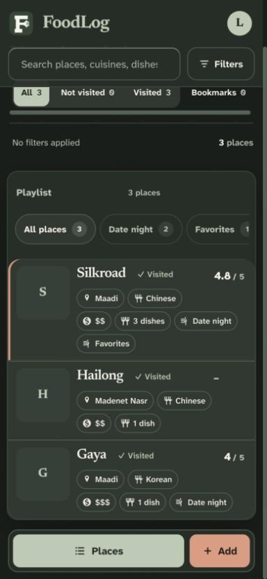
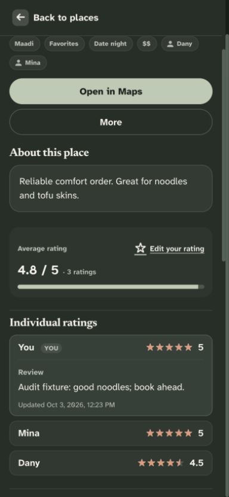

### 2. Restaurant review — draft protection needed

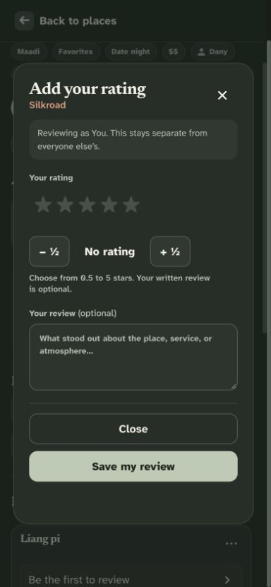
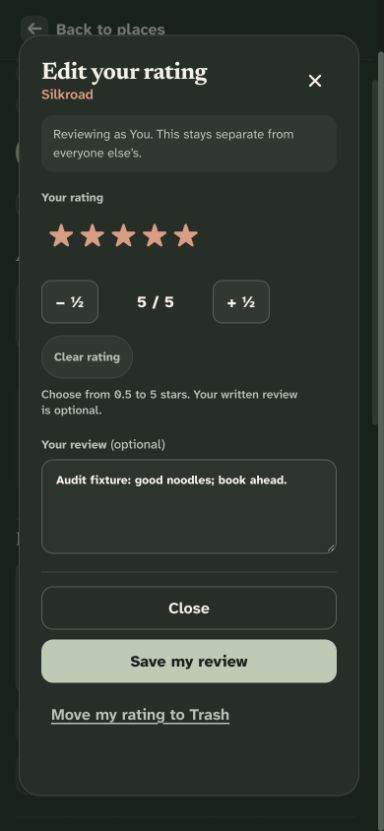

### 3. Dish reviews — actions need to be closer to the review

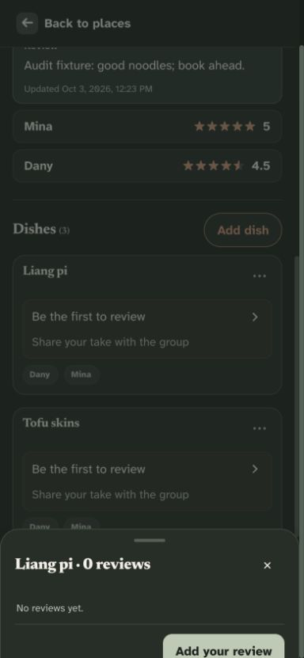
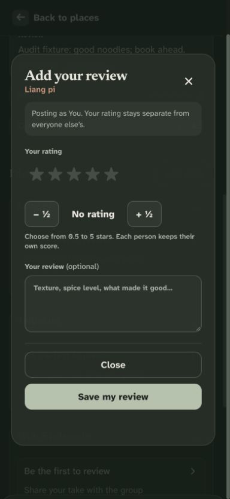
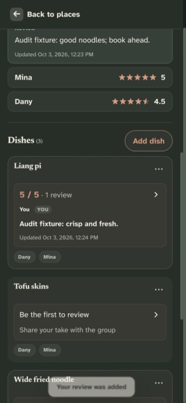
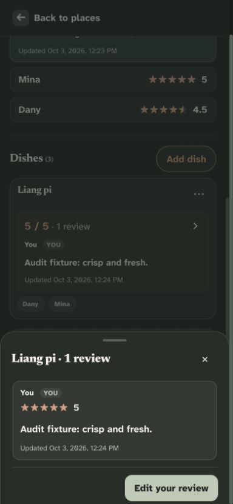

### 4. Search and filters — recovery works, wording needs improvement

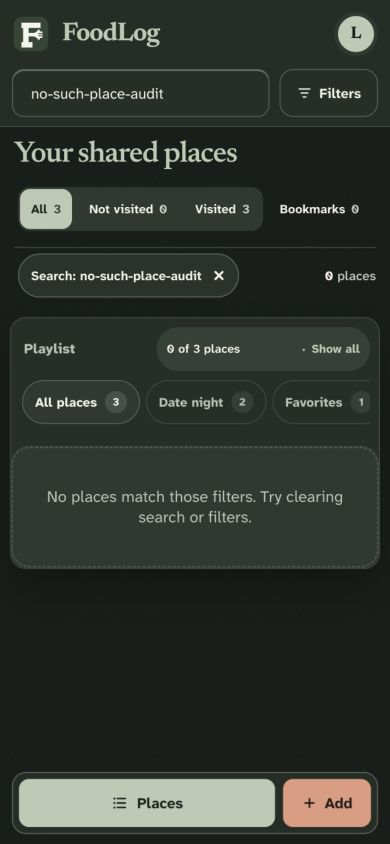
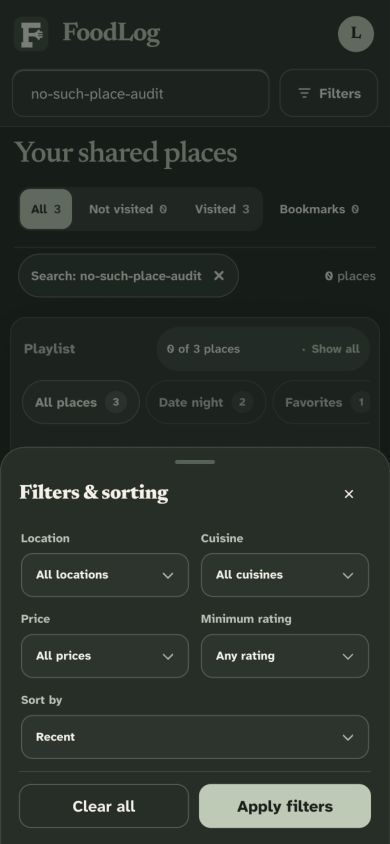

### 5. Add place — good simplified entry

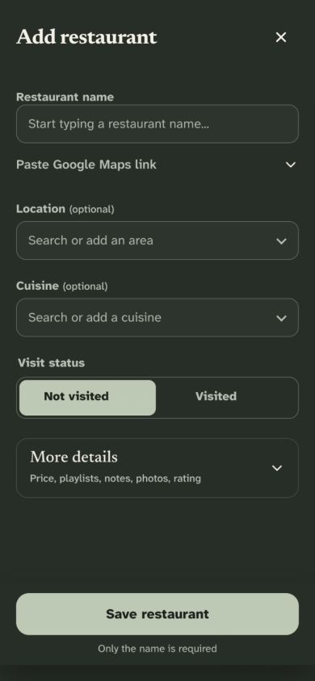

### 6. Bookmarks and Trash — available, shortcut opportunities

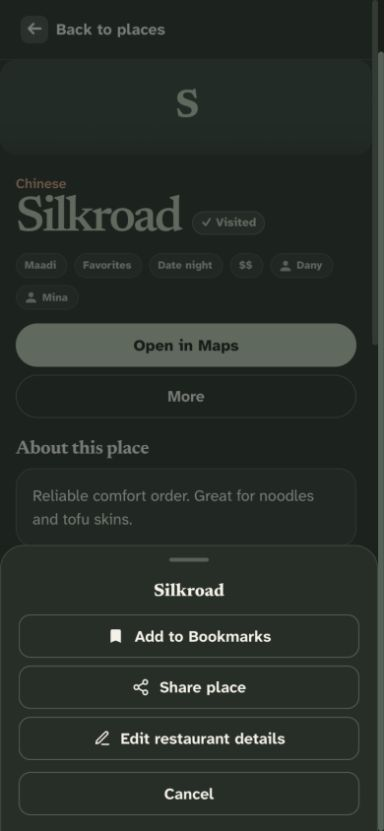
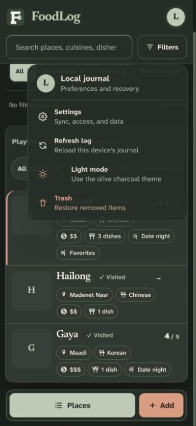
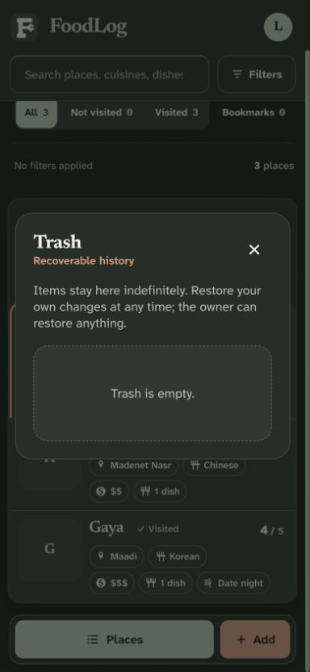

### 7. Desktop and themes — good overall hierarchy

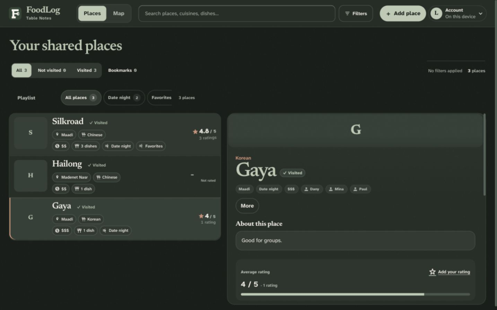
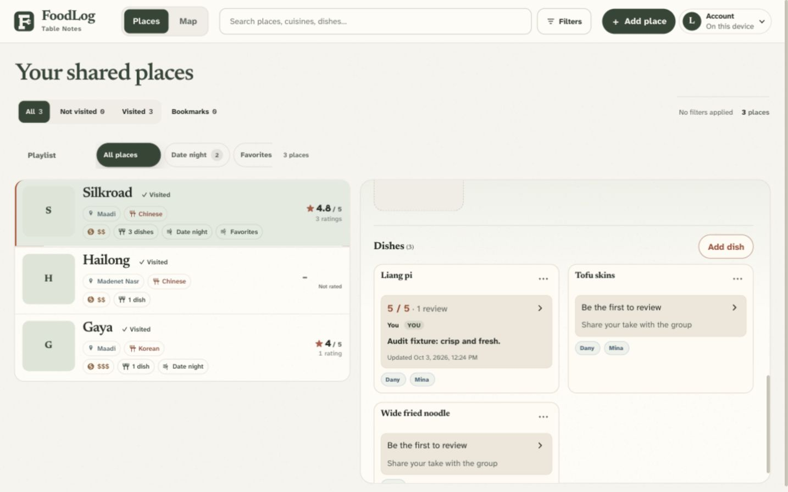
