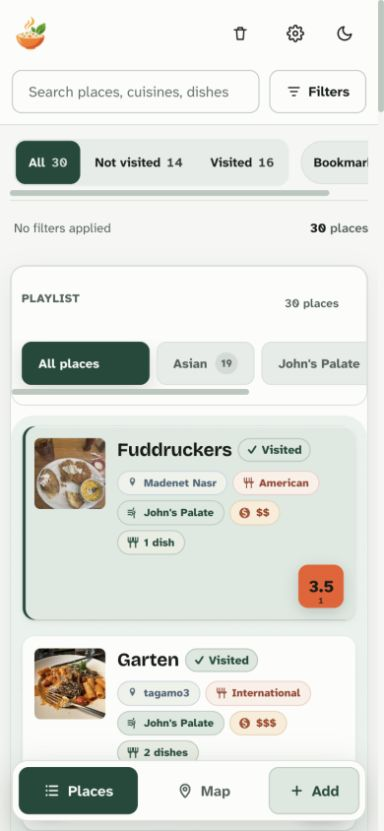
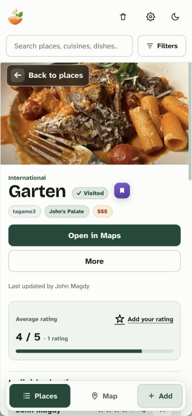
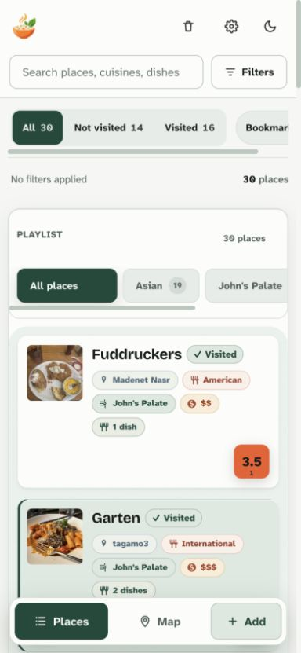

# Rendering and motion audit — 2026-09-11

Scope: live Places → Garten → browser Back at a 390×844 viewport, plus source review at commit `83c9126`. No application code changed. Screenshots captured in this run and inspected after saving. Recommendations below are not implemented plans.

## Verdict

The foundation is sound, but navigation and refreshes still disturb stable content. Fix those boundaries before adding animation. Keep the live Places underlay, opaque restaurant surface, intentional 118px top gap, direct transforms, 180ms drawer settling, photo swipe exclusions, and reduced-motion path.

The main list is **not rebuilt wholesale on every return**. `render()` runs and the surface change invokes list reconciliation, but unchanged rows and their images survive through keyed nodes and fingerprints (`app.js:4155–4279`, `lib/render-list.js:54–80`). Returning through browser history does not itself fetch remote data. Repainting, DOM replacement, and downloading data are distinct operations here.

## Captured flow

1. **Places — stable at rest.** Thirty places are available. Existing filter summary reserves its height. Captured before opening Garten.
2. **Garten — readable after settling, width instability on entry.** Back is visible, details and photos load, and the underlay is inert and hidden from accessibility navigation. Document client width changes from 384px to 390px when scrolling is locked; list width changes from 362px to 368px. This is a measured browser-specific shift, not proof that an overlay-scrollbar iPhone shifts by the same amount.
3. **Browser Back — content and selected place restored.** Garten receives focus and the list returns. This run began at scroll position zero; deep-scroll restoration and touch swipe timing remain unverified.

| 1. Places | 2. Garten | 3. Return |
| --- | --- | --- |
|  |  |  |

## Prioritized findings

| # | Severity / category | Before and evidence | After / fix summary | Why |
| --- | --- | --- | --- | --- |
| 1 | HIGH — navigation continuity | Swipe completes its slide and calls `closeMobileDetail({transition:false})` at `app.js:2803`. That function takes `history.back()` at 2685 and drops the option. `popstate` unconditionally uses `{transition:true}` at 7819, reaching the root View Transition in `lib/navigation.js`. | Carry the completed-gesture navigation intent into history restoration and settle once. Back button, browser Back, swipe, interrupted swipe, and direct-link close should share one explicit transition policy. | A completed swipe can be followed by an unnecessary whole-page snapshot transition. This contradicts the intended no-View-Transition swipe design recorded in the project log. Confirmed source path; touch sequence not profiled live. |
| 2 | HIGH — layout stability | `styles.css:5453` locks root/body overflow on detail open. Live measurements show document and list gain 6px width. | Preserve available layout width across scroll lock/unlock, including fixed rail and dock. Evaluate stable scrollbar gutters and compensation where needed, without adding a second mobile scroll container. | Even correct transforms feel unstable when stationary content changes width. This was measured in the in-app browser; test Safari separately. |
| 3 | HIGH — refresh isolation | Every successful remote load increments `state.dataVersion` (`app.js:3043`). That changes the filter fingerprint (4718); `filtersChanged` forces `renderDetail()` (4785), which replaces the complete detail HTML (4455) and mounts new carousels (4569). Mobile open/close also belongs to the detail fingerprint (4753). | Separate content dependencies from navigation and filter chrome. Retain unchanged detail sections, decoded images, and carousel positions; patch actual changes by identity. Skip list reconciliation on detail-only navigation where appropriate. | An unrelated refresh can recreate the restaurant being read and reset photo tracks. Existing filter invalidation was deliberately broadened to fix stale ratings/photos; replace it with complete dependencies and regression coverage, not simply deletion of that guard. |
| 4 | MEDIUM — repeated motion | `app.js:3914` recreates all applied-filter chips when any chip changes. Every new node gets `applied-chip-in` at `styles.css:2910`, shifting/scaling unchanged filters too. | Reconcile chips by filter key. Keep unchanged controls still, update labels in place, and limit entrance feedback to intentional additions. | Filtering/searching should not make existing controls repeatedly arrive again. The current signature guard already prevents unchanged realtime refreshes from replaying them; preserve that benefit. |
| 5 | MEDIUM — layout animation | Mobile Show all transitions `max-width:0` to `7rem` over 220ms (`styles.css:5383–5392`). | Reserve a stable action box and use opacity/transform for visibility changes. Keep the action and count available. | Width animation forces repeated layout and makes nearby content move. |
| 6 | MEDIUM — gesture prediction | Release speed is total displacement divided by total elapsed gesture time (`app.js:2786–2791`), not recent finger velocity. | Sample recent movement and direction for flick intent. Preserve distance dismissal, cancellation, interruption, and reduced motion. | A pause followed by a short flick can be misread as slow. Validate on physical touch hardware before tuning thresholds. |

## Recommended product behavior

- Places remains the same scene while a restaurant is open: same row elements, decoded images, ordering, filter-strip position, and vertical anchor.
- Only the restaurant surface and its intended underlay treatment move during navigation. Opening and closing each have one transition owner. Keep the existing `--ease-drawer: cubic-bezier(0.32, 0.72, 0, 1)` and 180ms settle initially.
- Server data remains fresh, but unrelated updates do not rebuild what someone is reading. During an active gesture, queue visual changes until settling completes; handle changes and deletions explicitly afterward.
- Separate per-place detail scroll/photo state from list state. Decide and document whether an explicit new visit to a place starts at its top or resumes; passive refresh must preserve the current reading position.

## Additive opportunities

1. Give the visible Back button the same spatial close behavior as a successful swipe, where history restoration currently chooses a root crossfade.
2. Preserve a visible row anchor when actual data changes affect recent-sort order, so the user does not lose their reading position. Keep fresh data and ordering semantics; avoid silently freezing updates indefinitely.

## Verification required for implementation

- Open/close the same restaurant repeatedly from the middle of a long list. Assert unchanged list/image node identity, scroll anchor, horizontal filter position, and stable rail/dock bounds. Assert navigation alone makes no data request.
- Complete and cancel swipes; interrupt opening and settling; test slow-drag/pause/flick and reversal on an actual phone. Verify one transition and no late crossfade. Cover Back button, browser Back/Forward, Map entry, and direct links.
- Deliver an identical remote refresh and an update to another restaurant while viewing photo 2. Assert the selected detail, carousel identity/index, and scroll remain stable. Then update ratings, cover, photo deletion, and permissions on the current restaurant and confirm content is fresh.
- Trace frame time, layout/paint, and long tasks under representative data and slower CPU. This audit did not measure FPS, Core Web Vitals, or image re-downloads.
- Verify reduced motion, keyboard focus restoration, inert underlay, and screen-reader navigation. The current code has these foundations, but screenshots cannot establish accessibility compliance.
- Do not re-enable mobile `content-visibility:auto`; the project log records a WebKit zero-height-list regression. Preserve normal page scrolling on mobile.

Decision: **Block premium-motion sign-off** pending the navigation/width/refresh fixes. This is an audit verdict, not a deployment change. Suggested first batch: findings 1–3; then filter stability and gesture tuning.
